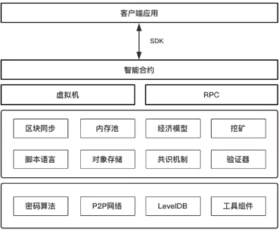

### 以太坊的特点

- 我们来看下如何基于区块链的一个公链 --- 以太坊 来开发一个DAPP (Distributed Application) 分布式应用(特指基于区块链系统开发的应用)
- 我们可以基于很多种区块链系统开发，这里选择以太坊，因为以太坊是继比特币之后，第一个支持链上自定义合约开发的公链系统，它的设计是很有代表性的
- 比特币是一个主要来实现电子现金系统的一个基础区块链系统；而以太坊，它是一个**通用的区块链编程平台**，它本身也包含一个代币叫以太币
- 可以在以太坊上面灵活开发自己的应用，在比特币上面的，我们是很难对比特币本身去做什么灵活的开发
- 比如说基于比特币这个节点程序来开发溯源系统，众筹系统，或者再开发一个比特币系统，这是比较困难
- 当然不是说完全没办法，至少它并没有很好的支持灵活的开发，而以太坊是支持的一个通用的，灵活的编程平台，**支持自定义智能合约**，它可以用来开发这些上层的应用的
- 如果说比特币是一个写死的链上规则的平台，以太坊是一个支持灵活开发的平台，可以基于以太坊开发一个比特币系统，甚至可以基于以太坊开发一个以太坊系统
- 因此从以太坊的一个设计特点来看，同时，它既然是一个通用区块链编程平台，也是一个**支持图灵完备的虚拟机**的
- 所谓图灵完备的虚拟机，就是说我们所编写的程序里面包含了像一般编程语言的各种语法，我们可以有选择语句，循环语句，顺序语句，可以像写一般的程序一样来进行编写
- 在以太坊里面**支持账户对象**，同时也支持更复杂的梅克尔树
- 以太坊最主要的一个特点就是它不是一个写死了链上逻辑的一个公链系统，它是一个可编程的，可灵活来实现链上逻辑的一个平台
- 为了实现这样的一些功能特点，它也是比比特币更复杂的架构设计以及更复杂的数据结构，包括不一样的账户对象，不一样的梅克尔树
- 比特币中的梅克尔树是一种二叉树，，而且只是对于区块里的一条一条的交易事务来做哈希计算而成
- 在以太坊里面的梅克尔树要复杂的多，**采用梅克尔-帕夏尔树**，首先它是一颗16叉树，因为它支持账户对象，也不止一颗梅克尔树：有交易树，有账户的状态树，有数据树等等

### 以太坊组成结构

    

- 以太坊是一个支持通用的应用开发的开发的这么一个平台，它一定支持一种开发语言：脚本语言
- 它会有一个虚拟机来执行这个脚本语言所开发而成的字节码程序
- 所有的区块链系统基本上都包含一些这些比较相同的模块，如：密码算法模块，都是p2p网络, 都有区块数据的存储
- 同时都会支持挖矿机制，经济模型，还包括区块同步基本功能以及共识机制
- 包含了可编程的平台是以太坊的主要特点，这里它有虚拟机，脚本语言，以及上层实现的一个智能合约
- 编写智能合约以后，将智能合约的程序编译为字节码(以太坊虚拟机可识别和执行的一种文件格式)
- 以太坊在脚本指令这一块做了一个主要的扩展，其他方面都属于基础的区块链系统的通用设计

### 与比特币的异同

- `数字货币`
    * 比特币基本上只是一个数字货币系统，虽然也能通过平台来实现一些比较简单的存证功能
    * 甚至可以在比特币上发一个数字货币，但并不是比特币本身支持的，而是利用它的存证字段在做第二层协议的支持实现
    * 以太坊本身是支持编程能力，是可以通过编程的方式来实现链上各种应用，所以以太坊不再只是一个数字货币系统
- `区块存储`
    * 比特币是一种文件存储的方式，并且是一个个字节来写入文件，以太坊使用k-v数据库，也就是LevelDB数据库，也是一种文档数据库
    * 比起比特币实际上具备了更加方便的操作功能，不太需要字节的方式来写入，而是可以通过这种key-value的方式来读写
- `挖矿共识`
    * 比特币是一种工作量证明，通过哈希这种工作量证明(POW)
    * 以太坊一开始其实也是工作量证明(POW)，只是工作量证明的方式，使用的哈希算法，包括一些具体的一些细节是不一样的，但它都是一种工作量证明
    * 在以太坊后期的升级过程中，又开始转向了POS机制，不再是工作量证明，这个也是跟比特币的一个差别，以太坊对共识是有这种改动和升级的规划的
- `固定指令跟智能合约之间的差别`
    * 比特币上面的指令集基本都是固定的，就导致我们基本是没办法在比特币上实现灵活的编程
    * 以太坊支持的是智能合约，它有一个可编程的环境
- `UTXO模型跟账户对象的差别`
    * UTXO就相当于我们企业的仓库的入库与出库，也就是一笔一笔的流水账，但是并不去专门来记载这个库存是多少
    * 如果想要知道库存是多少呢，就得把入库出库拿过来自己计算一下
    * 以太坊是记录了这个状态，也就是说把库存表记下来了，不但记录入库出库，也记录库存表
    * 因此也因为以太坊记录了这么一个状态，所以基于以太坊实现智能合约就具备了一个条件
    * 因为智能合约的实现，首先合约本身也是一个程序，就得存在一个地方，并且要有一个地址可以去调用它
    * 如果只有流水账，是很难去做这样一个智能合约的部署，以太坊实现了这种更加扩展的编程能力，所以对这种账户模型也就有些区别，不再是比特币这种UTXO模型
    * 然而，并不是说以太坊实现了这些不一样的账户对象，就比UTXO更加先进，这是一个误解
    * 事实上UTXO是有很大的一个优势，也有一些受限的地方，同时，账户对象这种模式也是一样，有自己的优势，比如说取数据方便，或者说统计比较的方便, 但是也有一些缺陷
    * UTXO模式能够支持并发处理交易事务的能力，账户对象则速度慢一点
    * 因为为了来防止双花攻击，UTXO是一种未花费事务输出的这么一种方式，而账户对象是通过一种叙述的方式
    * 对于UTXO来讲, 每一个事务输出只能被引用一次, 只要被引用过，就不能重复被引用，通过这种方式防止双花
    * 对于账户对象来说，所谓的账户对象就是说我不是去引用一个之前的输出，而是一个增减的过程，就跟银行这个账户一样
    * 既然这样，我如果截获了用户的转账事务的时候，重复对一个结点发送转账事务，那就会导致这个账户再重复的被转账
    * 这个问题在以太坊中通过一个很简单的方式来解决，它是在账户对象里面增加了一个nonce这么一个值，每发送一次事务就加1
    * 比如，第1次是1，那么这个带1的事务一旦被打包就不能再接收另外一个是1的了
    * 如果要发送是2的，那就得重新签发，通过这种方式，使得黑客没法来进行攻击
- `公链设计`
    * 相同点就是它们都是公链
    * 都符合公链的一般性的架构设计

### 以太坊应用

- 投票应用
- 数字资产发行
- 众筹系统
- 交易系统(就是基于链的一个无中心的交易系统)
- 加密数字游戏(可以开发游戏, 如Kitty猫游戏等等)
- 交换原子
    * 两种不同的基于链上的资产不需要一个第3方背书的前提之下，可以来进行一个安全信任可靠的一个交换
    * 所谓原子，就是要么双方的交易成功，要么失败，任何一方都是无法通过耍赖作弊等方式来单方面的来获得收益的
- 数据存证
- 结算支付
- 其他业务应用
- 我们基于以太坊可以去开发这些应用，但这些应用是否适合部署在以太坊上，要根据具体的场景去做具体的分析

### 小讨论

- 以太坊和比特币差别到底有哪些 ？
- 以太坊的账户对象和比特币UTXO的区别有哪些 ?
- 你是怎么理解智能合约这么一个概念的?
    * 包括基于供应链的这个智能合约，它本身的设计应该怎样说更合适
    * 它本质上又是一个什么样的东西 ?