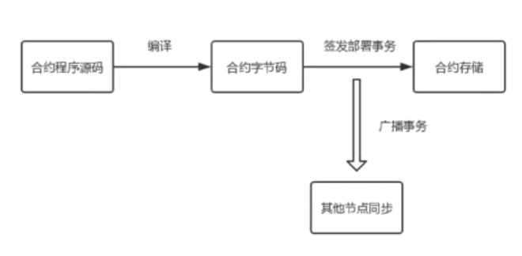

### 智能合约的结构

```js
// 指定编译版本
pragma solidity ^0.4.21;

// 指定contract名字
contract MyBank {
    // 定义合约中的变量
    mapping(address => uint256) public balanceOf;

    function MyBank(uint256 initAmount) public {
        balanceOf[msg.sender]= initAmount;
    }

    function transferCoin(address _to, uint256 _value) public {
        balanceOf[msg.sender] -= _value;
        balanceOf[_to] += _value;
    }
}
```

- 上面就是一段智能合约程序，类似javascript，里面有方法, 有变量
- 以太坊支持的智能合约，其实就是一种语言(一种这种可编程的语言)
- 实现智能合约的语言有很多中：python, javascript, C#等等，语言只是一个前端的一个语法表示
- 以太坊的智能合约程序编写完之后，是需要编译的，之后生成字节码，字节码是EVM(以太坊虚拟机)能够识别的
- 智能合约这个程序，是要通过以太坊上面的EVM, 也就是以太坊虚拟机来具体的执行，来实现里面的功能
- 我们来分析下上面的代码
    * 前面第1行代码，而是指定了一个编译的版本
    * 随着以太坊节点的升级，支持的智能合约语言的语法也在有升级，包括编译器等都有一些升级
    * 从语法角度来讲指定的编译的版本，指定了智能合约的名字，我们的名字叫MyBank
    * 在这里面定义的一个变量映射mapping, 把地址映射到256位的一个值
    * 下面是一个方法，函数，实现了初始化余额的赋值
    * 以及一个transferCoin一个转账功能
    * 这里msg.sender表示智能合约的调用者的账户地址
    * transferCoin表示调用合约者地址里的余额减去value指定的值
    * _to就是目标对象的地址加上value这个值
    * 这个和通常的程序差不多，只是语法上定义了一个自己的格式
  
### 智能合约的存储

- 智能合约既然是一个程序，它当然得要有个部署这么一个过程，这个程序首先需要编译
- 前面是一段源程序，源程序不能直接在以太坊虚拟机上执行，得把它编译为字节码
- 编译成字节码的是通过编译器来编译的，之后需要把字节码部署到区块链账本(以太坊上)，所谓的部署其实就是存储到以太坊上
- 在以太坊上面这个部署的过程其实就是发起一个事务，`sendTransaction({from:"", data:""})`，通过哪个账户地址来发起这个事务的，那就通过哪个账户来部署的，data后面跟着字节码
- 发起这个事务，其实就是构造一个事务结构，然后广播到以太坊的节点上，以太坊节点接收到这个事务后，会进行一些校验，然后会继续广播到其它节点
- 通过这个方式，实现了智能合约的存储，并且这个部署合约的过程是需要消耗Gas的，也就是说是需要消耗以太币的
- 简单来说，部署就是一个事务过程，具体来说它又是怎么存在以太坊的呢？
- 实际上在以太坊里面，所谓智能合约里面除了方法，其实就是一些状态变量，也就是这个合约的状态
- 这些状态变量是存在一个巨大的数组里面，对于合约里面的每一个状态变量，都会分配一个32字节的存储空间
- 这是一个巨大无比的一个存储空间，每次有智能合约的方法来执行以后，改变了这个状态值，会相应的对这个存储空间来做修改，也就是留下了一个状态
- 这个也就是以太坊智能合约的部署

<div align="center">
    
</div>

- 合约程序源码通过编译生成合约字节码，字节码再通过签发部署事务来部署到以太坊的节点上，把合约存储在链上，并且生成合约程序的地址
- 同时把事务同步到其他以太坊的节点上，每个节点都拥有了这一份合约
- 如果某个节点还没有同步到这个部署的合约，那我们都对这个节点去调用的话，是调用不到相应的合约

### 智能合约的执行

- 把智能合约部署到链上以后就可以来执行合约里面的方法
- 所谓的执行就是对合约中的方法进行调用
- 我们执行过程其实也是发起一个事务交易
- 还是这个`sendTransaction({from: "", to: "", data: ""})`
    * `from` 是指谁来执行合约
    * `to` 是指调用哪一份合约，就是指合约的地址，在以太坊里面的地址分成两种，一种就是通常的这个账户地址，1种呢就是合约的地址，
    * `data` 是指合约的哪个方法以及这个方法有什么参数
- 这个执行本身可以消耗Gas

### 智能合约的特点

- 支持灵活编程的一个平台，支持复杂逻辑的实现，我们可以在里面写各种复杂的智能合约逻辑(商业里面的各种商业逻辑，游戏的各种逻辑等)
- 同时支持自定义编程, 通过虚拟机来执行的
- 一般来说, 如果是支持这种区块链合约程序的平台，往往都会通过虚拟机来执行这个合约程序，当然每一个节点都是同等运行的
- 合约程序往往支持内部触发，什么叫内部出发呢？
- 就是打个比方，转账，在比特币里转账，一定要在链的外部，通过私钥来签发，然后广播这个带有签名的交易事务(转账事务)
- 然而对于智能合约来说，可以在智能合约里面写程序来自动的转账，这个就叫做内部触发，内部触发机制其实并不是很安全，只是智能合约的一个特点
- 大家在实现自己的智能合约的平台的时候可以尝试，比如支持智能合约的编写，但不支持触发，主要是看我们如何来实现

### 小讨论

- 如果智能合约和数据库去比较，它相当于数据库中的哪个对象？(比如数据库里面的触发器，存储过程等? )
- 部署智能合约与调用智能合约的过程是一个什么差别？
- 智能合约的执行与普通程序有什么差别呢？