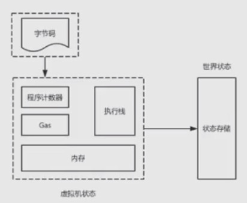

### EVM的作用

- EVM: Ethereum Virtual Machine 以太坊虚拟机
- 在以太坊上如果我们要转账, 部署智能合约, 调用智能合约都是EVM来执行
- EVM是在以太坊上的作用
    * `是以太坊节点的功能引擎`
    * `执行以太坊交易事务`
    * `部署、执行智能合约`
    * `每一个节点都有独立的EVM`
        * 每个节点都有一个自己的EVM
        * 每一个节点都会一致的执行同样的事务
        * 把智能程序部署这个动作广播到其他的节点
        * 其他节点接收到这个事务以后会调用EVM来同样的部署和广播
        * 也就是说每个EVM，大家都会做一样的事务
        * 这样才能保持一致性
    * `本质上是通过动作的执行更改账本的状态`
    * `每个EVM都会一致的执行同样的事务`

### EVM与字节码

- 所有的智能合约的部署调用，包括以太币的转账等等，都是通过EVM来执行的
- EVM具体执行的是一个什么东西呢？`EVM执行的是智能合约编译后的字节码`
    * 作为虚拟机，它得能执行自己可以识别的格式的数据，这个格式是EVM的字节码
    * 字节码是EVM特定格式的，EVM只有对自己能够识别的数据才能进行执行
- `可以通过各种语言来编写智能合约`
    * 我们要先编写一下智能合约，可以通过各种支持的语言
    * 以太坊默认的是一个叫Solidity, 语法格式类似javascript
    * 目前在以太坊上可以用来编写智能合约的语言，并不只是Solidity一种的
    * 不管用什么语言编写的，最终会编译成EVM能够识别的字节码格式
- `EVM只识别字节码格式`
    * 因为EVM执行的是智能合约编译后的字节码
    * 而不是我们的源程序
- `字节码包含用户的状态数据`
    * 比如我们的商品系统，众筹系统，这个系统里面都会包含一些数据
    * 对于程序来讲，总得留下一些数据才有意义
    * 这个数据我们称之为状态数据，也就是所谓的属性，状态
- `字节码包含EVM能执行的指令`，除了包含数据，还有EVM能够执行的指令
    * 这些指令比如，哈希计算，椭圆线的计算，取得一个区块高度等等各种计算
    * 包括虚拟机执行的一些动作，进栈，出栈等动作
- `EVM与JVM类似都是栈式虚拟机`

### EVM与共识验证

- EVM的作用就是用来执行以太坊网络中各种各样的智能合约，各种各样的事务
- 这些事务如果只是在一个节点上执行是没有意义的
- 对于p2p网络来讲，尤其是区块链讲究账本统一的网络系统来说，必须通过一个共识来使每个节点的账本达到一个一致性
- 也就是说共识是在于保持每个节点的账本统一
- EVM是执行事务更新账本的状态，也就是说，通过共识机制使得每个节点上都能调用EVM, 执行同样的动作，更新出同样状态的账本，来保持一致
- 谁来决定某一时刻到底是做哪些更新呢？那就是矿工，当它获得打包权以后，决定了某一时刻全网需要更新的事务
- 包括共识验证，使得每一个节点都能来进行相应的执行
- EVM是做具体的执行的事情，而矿工决定某一时刻执行哪些事务

### EVM的执行结构

    

- EVM是虚拟机，虚拟机一般分两种结构，继承器式的虚拟机，一个是栈结构虚拟机
- EVM和Java中的JVM类似, 是栈结构虚拟机
- EVM在具体执行的时候会先加载字节码，字节码中包含数据，包含指令
- 程序计数器就像指针一样，一步步的告诉执行栈当前要执行的指令
- Gas是决定每次对字节码的执行需要消耗的成本, 它是防止死循环式的执行
- 一旦调用者的Gas(以太币)消耗完毕之后，就停止调用
- 在执行过程中涉及到的变量等数据会加载在内存中作为一个缓存
- 整个执行过程执行完了之后形成了一个世界状态(状态存储)
- 对于以太坊的账本来讲，虚拟机在执行过程当中所产生的各种临时的状态，叫虚拟机状态
- 只有它执行完成以后，最后的状态才是账本的状态，这个称之为状态存储

### 小讨论

- 不同节点具备的EVM都是一样的吗？
- 什么叫世界状态?
- EVM属于什么类型的虚拟机?