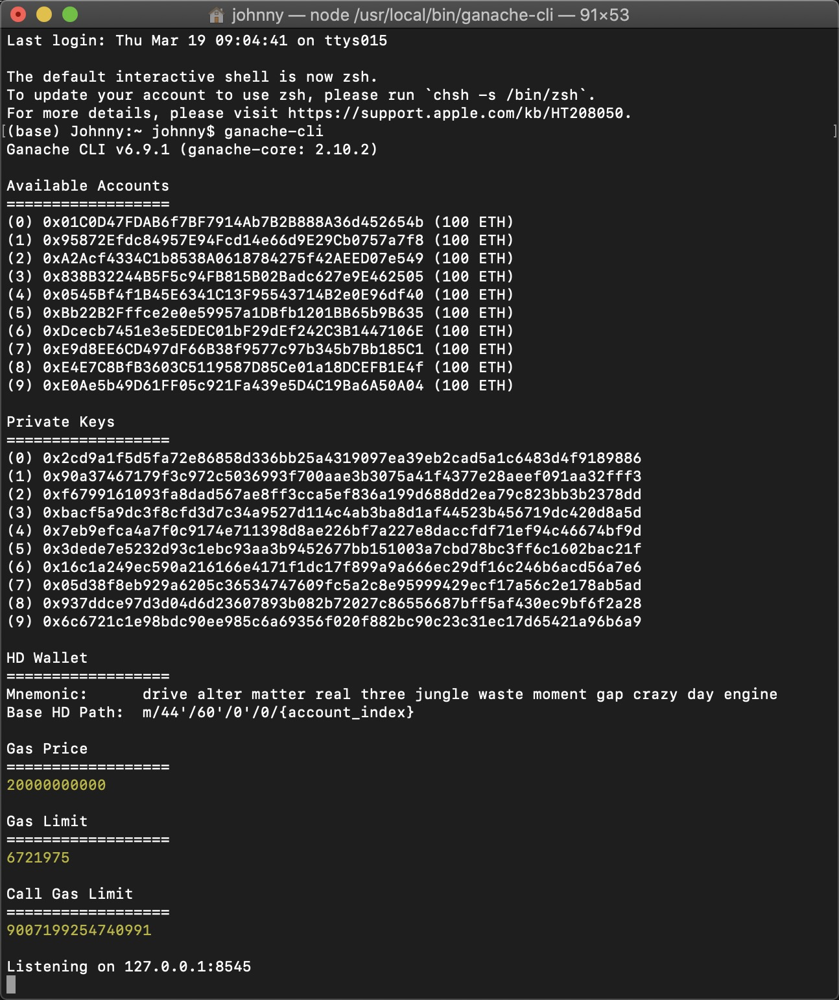

### Truffle

- Truffle是以太坊智能合约的开发工具
- 通过这个工具可以对我们的智能合约来进行编译，测试，以及部署，相当于一个自动化的一个东西
- Truffle本身使用nodejs来开发的，并且是开源的
    * 官方地址 https://www.trufflesuite.com/truffle
    * 中文文档：https://truffle.tryblockchain.org/
- 通过Truffle可以对多份合约来进行编译
- 提供编译、测试、部署功能，很自动化
- 安装：$`npm i truffle -g`
- 版本查看：$`truffle version`
- 创建最小工作目录：$`truffle init`
    * 如果我们不想去开发一个某种特定模板的应用，只想创建一个最基本的工作目录
    * 我们可以看到执行这个命令之后呢，执行所在的当前目录中就会生成如下的文件：`contracts`, `migrations`, `test`, `truffle-config.js`
    * contracts是存储智能合约源代码文件的
    * migrations是部署相关的配置
    * test 是测试目录，配合 truffle test
    * truffle-config.js 做一些配置，比如连接哪个节点等
- 下载示例模板：$`truffle unbox <box-name>`
    * 假如我们想开发一些具体的应用，比如宠物商店，带有web前端的DApp
    * 为了方便开发具体场景的应用官方提供一些模板
    * 相当于把一些特定场景的应用，基本的文件结构，基本组件事先准备好了
- truffle是一个轻量级的集成开发工具

### ganache-cli

- 是一个方便开发以太坊的框架工具, 它是一个以太坊模拟系统
- 我们要开发一款以太坊的智能合约，最终要连接一个节点
- 当然我们也可以直接连接以太坊主网的全节点，但是比较麻烦
    * 我们在使用过程当中需要消耗真实的以太币(成本)
    * 需要等待矿工打包，不适合我们测试环境
    * 我们测试的时候只是希望有一个模拟系统
    * 它可以直接生成一组账号地址，能够直接模拟挖矿，方便我们来进行一个智能合约的测试使用
- 使用Ethereumjs模拟的以太坊全节点
    * 它是一个模拟工具(模拟器)
- 使用Nodejs开发并发布的一个Node包
    * 本身也是使用nodejs开发的，通过npm安装
    * `npm i -g ganache-cli`
    * 控制台直接输入`ganache-cli`，就可以启动起来
    * 可以看到它默认生成的10个地址，以及包括对应的私钥
    * 这就是这个模拟器方便我们测试使用的一个原因，自动生成一些测试所需要的一些数据

    

### 合约编写

- 就是一般的源代码的编写
- 使用任何编辑器都可以源码编写：vim/vscode
- 随着以太坊的流行，很多编辑器都已内置了一些插件，用来支持Solidity语言(默认合约编程语言)
- 合约编写完成后保存成一个后缀为.sol的源码文件，等待编译

### 合约编译

- 以太坊1.5版本的节点可以在控制台编译，有相关的一些编译命令的
- 后续版本去除了这个功能，需要在外部编译
- truffle编译命令 $`truffle compile`
- 编译完成后生成相应字节码

### 合约部署

- 在以太坊上合约的部署跟转账，合约调用，本质上都一样，对以太坊来说都是发送一笔交易
- 这笔交易用于合约部署，也就是账本存储把字节码存下来
- 使用truffle工具, 当它连接到一个节点以后，使用$`truffle migrate`就可以把合约部署到节点上
- 这个节点会把相应部署动作，以发送交易的形式广播给其他节点

### 小讨论

- 以太坊智能合约的编译部署有哪些途径?
    * 除了truffle是否还有其他的工具
- 使用truffle工具可以把一个智能合约部署到自己的私有链吗？