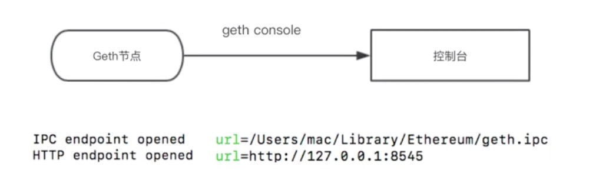

### 合约调用方式

- 合约调用的三种方式
    * `IPC方式`
        * 通常是通过控制台的方式
        * 以太网的节点在运行之后，可以打开一个控制台
        * 在控制台里面呢通过输入命令的方式，可以来调取一些智能合约的方法
        * IPC的方式也成为**管道通信**
        * 主要是进程之间的一个调用方式
    * `HTTP的方式`
        * 这个是比较常见的一些方式
        * 通常是使用JSON格式来做数据的序列化与反序列化
        * 也就是HTTP的JSON RPC的方式
    * `websocket的方式`
        * 以太坊内部支持使用websocket协议直接对节点内部一些合约接口来进行调用
- 在这三种方式中，我们通过客户端来调的话是后两种，HTTP的JSON RPC的方式以及websocket方式
- 而第一种IPC的方式更多的是在本机本节点来做一些访问调试，是进程之间的一种管道通信方式

### RPC/IPC调用

<div align="left" style="margin-left:100px">
    
</div>

- 上面是Go语言版本的以太坊全节点程序
- 也是以太坊官方维护的一个优先级最高的一个节点程序的版本叫geth，也就是Go语言的eth节点
- 它运行之后，可以通过这个命令 $ `geth console`，带上这么一个子命令，这样来运行全节点以后，就会进入到一个控制台，就能进入到控制台
- 在控制台里面它会打印出一些与连接相关的信息，我们可以在这里看到它有 `IPC endpoint`，也就是IPC的一个连接地址
- 这里是使用MAC系统来运行的，它是在这个`/Users/mac/Library/Ethereum/geth.ipc`默认的位置生成一个这样一个文件`geth.ipc`
- 这个IPC的连接通信方式就是通过这个共享的一个文件来进行连接的
- 也可以来打开另外一个控制台,只要来指向这个ipc文件就可以
- 另外就是HTTP的链接地址, 我们是在本地，所以它是127.0.0.1, 端口号是8545
- 进入控制台以后可以通过很多的命令来访问以太的节点
- 控制台中输入exit命令可以退出

### 常用RPC调用框架

- 对于以太节点来讲，它是支持一个节点内部的RPC服务端
- 对于客户端来讲的，目前已经支持了很多种语言的版本，比如支持Javascript的语言版本叫web3.js，这个版本也是最常用的版本
- 除此以外，有面向Java语言的web3j
- 面向C#的Nethereum
- 支持Ruby语言的ethereum-ruby
- 以及随着发展可能也会去支持其他语言的版本
- 当然也可以自己来封装，这可能是因为以太RPC的支持的接口都是开源的，我们也可以自己来根据需要来来做自己的封装

<table>
    <tr>
        <th>Library</th>
        <th>Language</th>
        <th>Project Page</th>
    </tr>
    <tr>
        <td>web3.js</td>
        <td>JavaScript</td>
        <td>https://github.com/ethereum/web3.js</td>
    </tr>
    <tr>
        <td>web3j</td>
        <td>Java</td>
        <td>https://github.com/web3j/web3j</td>
    </tr>
    <tr>
        <td>Nethereum</td>
        <td>C# .NET</td>
        <td>https://github.com/Nethereum/Nethereum</td>
    </tr>
     <tr>
        <td>ethereum-ruby</td>
        <td>Ruby</td>
        <td>https://github.com/DigixGlobal/ethereum-ruby</td>
    </tr>
</table>

### 关于web3对象

- web3.js对象
    * 以太坊JavaScript API
        * 在web3这个github仓库中可以看到, [https://github.com/ethereum/web3.js/tree/1.x/packages](https://github.com/ethereum/web3.js/tree/1.x/packages) 这个目录
        * 是包含了一组已经封装好的客户端的调用库, 它是以太坊的Js版本的SDK
        * 导入后，有个类叫Web3, 在web3这个库里调用了上面的各个子库，来实现了这么一个封装，可查看[官网示例](https://github.com/ethereum/web3.js/blob/1.x/packages/web3/src/index.js)
    * 普通 JSON RPC 
        * 参数和返回值都是通过json来序列化和反序列化的
    * 需要配合以太坊节点使用
        * 可以是正式主网节点，也可是测试部署私有或模拟节点
- web3对象的调用测试代码
    ```js
    var Web3 = require('web3');
    if(typeof web3 !== 'undefined') {
        web3 = new Web3(web3.currentProvider);
    } else {
        // set the provider you want from Web3.providers
        web3 = new Web3(new Web3.providers.HttpProvider("http://localhost:8545"));
    }
    var Version = web3.version;
    console.log("client version: " + version);
    ```

### 基于Nodejs示例

```js
var Web3 = require('web3');
if(typeof web3 !== 'undefined') {
    web3 = new Web3(web3.currentProvider);
} else {
    // set the provider you want from Web3.providers
    web3 = new Web3(new Web3.providers.HttpProvider("http://localhost:8545"));
}

web3.eth.getAccounts(console.log);
```

输出10个生成的地址

```shell
null [
  '0x437615686191efF890C7cCa136cfbf21Cb6451E6',
  '0xe4a56746DAfDf247BF125d5809B2D6168722Eb37',
  '0x23604b6563d63D5f3b4C9a09ADe681F5f2811DB6',
  '0x4900AEeA7CC7F76E473805c50E8F0e49c1F99D8E',
  '0x1A32509bC3DAA2AC5493AE212064e59ebeaED34c',
  '0x7c0c971814dBA35D5c53E5650b71E91ecb8C31fa',
  '0x2DB7594e84DC79EE782f3962C1ea9cC2912c3EF1',
  '0x9D86096d38B4460Be319dA56265499D863ccB5c4',
  '0xD03cbC188201EB3AB61aC465Dc1e3A2fa517245C',
  '0x77238F0407aF96Fd26Fe22A9996B2349F1ebb91f'
]
```

### 小讨论

- IPC与RPC访问方式区别是什么?
- Web3.js中有哪些子模块?