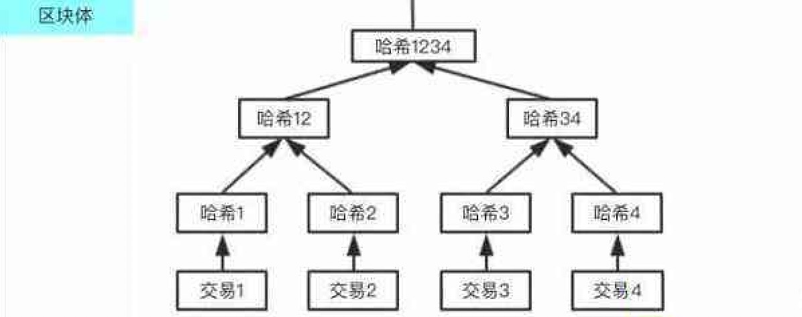
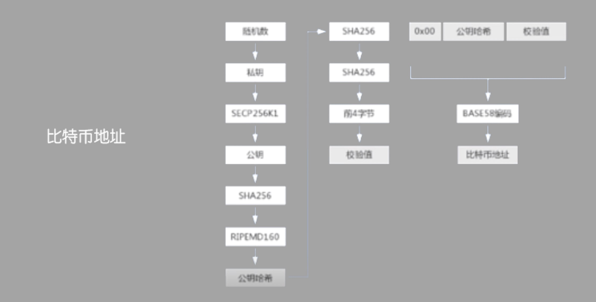

### 区块链的特定数据结构概述

以比特币为例

- 对于区块链来讲，首先它的数据是一个一个的区块，区块由区块头和区块体组成
- 区块头里有很多摘要信息：前一个区块的哈希值, 梅克尔根等等
- 区块体包含很多的事务数据(交易事务)
- 区块之间是由前序和后序之间环环相扣的一个链接
- 所有的区块链系统不管是用的什么不一样的密码算法、共识机制、脚本系统等, 它在区块链这样一个存储结构上是完全一致的。

### 梅克尔树

    

- 梅克尔树说的是一种特别有意思的一种数据结构，我们看上面这一幅示意图，这是一棵树结构，是一个二叉树的这么一个结构，当然梅克尔树并不是一定要是二叉树，但它通常至少是一个树结构，那么这里面放的是一个比较简单的一个梅克尔树的结构
- 它是指将交易事务数据计算出一个对应的值，也就是说区块体中每一笔事务的数据都会进行一个哈希计算，得到一个哈希值，比如说我们有4条数据的话，那就产生了4个哈希值了，我们再两两相配再继续产生新的哈希值，成为树的一个节点，不断的重复这个计算过程，最终得到了一个根哈希，也就是最顶层的一个哈希值，从而得到了一颗哈希树
- 那么整颗哈希树也就是我们所说的梅克尔树，它有什么特点呢？
    * 首先，它是可以用来证明数据的完整性的，由于它是把每一笔数据都计算了一个哈希值，并且哈希值之间又两两不断成对去计算哈希值
    * 当节点之间来进行这个区块数据的同步的时候，因为每一个区块头里面都含有一个梅克尔根，所谓的梅克尔根也就是也就是根哈希值
    * 那么当这个节点读取到梅克尔根这个根哈希值以后，然后再继续同步具体的区块中的事物的时候，如果说有一笔失误数据在网络传递过程当中发生了一些问题，比如被不小心的破坏或者说有某些恶意的节点特意的去传递一些假的这个区块数据
    * 那么这个时候呢，如果它的数据是跟原始的数据不一样的，那么当然，它也就没法来重构出一个一模一样的根哈希值出来，因为我们知道哈希算法的特点就是只要是输入的数据值不一样，它一定是得到一个完全不一样的哈希值。
- 那么通过这样一棵树的形式有什么好处呢？
    * 假如说我们的1号事务数据有问题，那么在这个时候呢，我们在同步数据进行校验的过程当中，就不再需要去把3号4号再去重新去做校验同步
    * 因为如果只是1号数据有问题的话，我们再校验34这一条分支的时候是没有问题的，而只是在12这个哈希值上面有问题，那么我们只需要去要求重新同步1号事务就行了
    * 那么这也是用来增强这个数据验证与同步的一个效率的一种机制
- 梅克尔树的应用，并不是说是区块链系统中的一个专利，但凡只要是使用p2p，这种对等网络结构来传递数据的，一般也都会使用到这种结构的
    * 比如说，github这个开源系统，而每一个不同的个体之间，他的数据传递的也会使用到梅克尔树来确保数据的完整性
    * 包括我们的各种BT下载等这种p2p网络软件其实都是一样的，都会使用到这种梅克尔树的结构
- 由于梅克尔树的这种特性一些资产类，金融类的应用中就特别的有效，可以实现比如说百分百的证明，对于众筹的一些资产，只要有任何的一个破坏，篡改，或者说挪用，那么它的一个梅克尔树的根哈希值都会发生变化，那么这个就是我们这一个区块链系统中很重要的一个应用 - 梅克尔树(哈希树)

### 账户地址

    

- 在通常的网络服务系统里面是没有这么一个概念的
    * 我们使用淘宝啊，京东啊，美团等等各种互联网应用的时候，一般就是注册一下用户名，然后有个密码，最多再有一个实名认证这些东西
    * 在区块链系统里面并不存在这么一个步骤，它没有一个注册的步骤，而是直接使用一个客户端来生成一个账户地址
- 那么什么叫账户地址呢？账户地址其实就是来源于我们前面说的密钥
    * 由于在区块链系统中所使用的主要的一个密码算法叫不对称密钥算法，也叫公开密钥算法，那么它有两个密钥，一个私钥，一个公钥
    * 私钥是专门用来签发自己操作的数据的，公钥是可以公开出去，留给别人来进行验证，看一下这个数据是不是由某一方来签发的
- 而账户地址，它实际上就是公钥转化而来的，我们这里的举了一个比特币地址的例子
    * 首先通过一种随机的方式产生一个私钥，为什么要通过随机的方式呢？因为私钥是不能有规律产生的，必须使用随机的方式产生私钥
    * 实际上这个SECP256K1是一种椭圆线方程，椭圆线密码算法是一种很常用的不对称密钥算法
    * 在椭圆线里面，其实私钥实际上就是一个整数，首先产生私钥，然后通过这个椭圆线的方程计算出公钥，然后接下去的所有步骤都是对公钥进行的一种转换，最终得到了一个所谓的这个地址
    * 也就是说地址实际上就是另外一种格式的公钥，公钥来自于私钥，也就是说账户地址实际上就是密钥的一种体现
- 那为什么我们需要地址这么一个的东西呢？
    * 因为对于这个密码算法，比如说这个椭圆线密码算法, 像是比特币的SECP256K1的密码算法, 它的密钥长度是很长的
    * 比如像私钥有256位这么长，对于一个密钥长度这么长的一个数据，显然我们是很难去传播，甚至是难以记忆的
    * 所以需要来产生一个比较短的这么一个数据格式，那么这那么这个所谓的账户地址其实就是一种压缩格式
    * 既然是一种公钥的压缩格式，那它的压缩的这些算法步骤就有很多种，不一定非得像比特币这里演示的一样，有这么复杂的一个过程
    * 实际上比如说像以太坊的话，它也就是也就是直接截了公钥的其中一段，比如说截了20个字节，我们是可以有很多种转化方式的
    * 由于这个地址是公钥转换而来的，只要有某种数据是能够跟公钥具备一个一一对应的关系，那么它都可以作为我们的地址
    * 所以这个账户地址是区块链系统里面一个比较特别的概念

### 小讨论

- 梅克尔树主要使用了什么密码技术来产生的？
- 如果一个区块的数据很大(比如说一个区块有100~200M，它在网络中有可能会发生什么问题？
- 账户地址和公钥是什么关系？
- 在一个区块链系统中账户地址是不是必须要有? 是不是必须要有一个地区这么一个东西？
- 请任意设计一种不同于比特币的地址的生成的算法