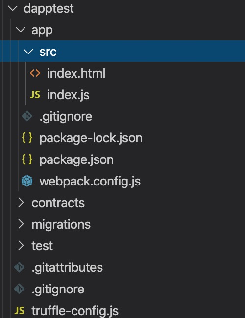
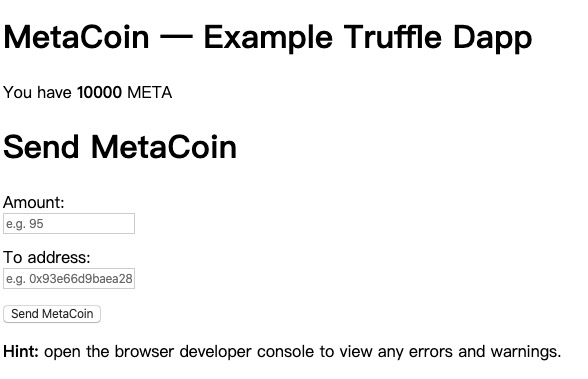

### 概述

只有智能合约不足以构成一个应用，还需要配合前端，后端才能成为应用本身

### DAPP的运行结构

- DAPP是一个分布式应用，以下是它的简要组成结构
  * `以太坊节点 + 智能合约 + 调用端 + 界面`
  * 以太坊节点 + 智能合约 是p2p网络结构的，没有明确的固定的服务端
  * 调用端和界面也就是所谓的前端，通常采用web框架结构
-  我们需要在这个基础之上的增设一个后端服务
  * 专门用来跟节点通信，以及汇总一些数据，和那些不适合放在合约中的一些业务逻辑
  * 也就是这么一个结构：`以太坊节点(智能合约) ---> 后端服务 ---> 前端程序`

### 环境准备

- 1.我们需要一个节点，可以使用ganache模拟节点或部署一个以太坊私有链，正式部署需要连接到以太坊的主网的节点
- 2.一般推荐 vscode 做代码编辑
- 3.使用Truffle来下载应用模板和编译部署
    * 如果我们需要开发一个基于web前端的DAPP可以使用它来下载官网支持的应用模板
    * 官方有一个box页面，有各种类型工程的模板
    * 基于一套工程框架来进行开发，不用从零开始

### 模板文件的选用

- 这里开发一个基于web前端的DAPP的例子
- 既然可以使用工程模板来快速创建目录文件，我们先建一个自己的一个工作目录`dapptest`
- 进入这个目录里面，我们就开始下载一个项目模板: $`truffle unbox webpack` 
- 这个项目模板的名字是webpack, 下面是基于web前端的dapp的工程目录

<div align="left" style="margin-left:100px">
    
</div>

- 这里app的目录其实就是nodejs工程的一个目录结构
    * node_modules是node的一些依赖库
    * src中的html是前端页面，js是业务逻辑(和以太坊以及前端页面交互)是Dapp的中间层也叫应用后端
- 当然这里是使用nodejs来开发的目录，其他语言开发会有相对应文件
- contracts是我们自己编写的合约
- 其他文件是与Truffle相关的一些文件
- 我们可以看到nodejs工程被集成到了truffle目录中去了

### 项目的运行

- 我们下载的这个工程模板文件，其实已经内置的一些合约
- 可以来直接运行这个例子来看一下: $ `truffle develop`
    * 这里只是想运行一下这个测试程序
    * 我们就不需要去专门启动节点了
    * 当然我们也可以启动一个以太的私有节点或者ganache模拟节点
    * 这里为了方便，通过这个命令启动了truffle内置的一个节点环境
    * 可以看到它同样的监听了本机的8545端口，然后默认了就创建了10个账户地址
- 由于我们进入了truffle本身的环境，所以可以直接来做合约的编译和部署, 在console控制台输入一下命令：
    * $ `compile`
    * $ `migrate`
- 编译，部署完毕之后，就可以进入到app这个目录里面，来启动我们的示例的合约程序
    * $ `cd app`
    * $ `npm run dev`
      ```shell
      > app@1.0.0 dev /Users/johnny/Code/github/block-chain/dapptest/app
      > webpack-dev-server

      ℹ ｢wds｣: Project is running at http://localhost:8080/
      ℹ ｢wds｣: webpack output is served from /
      ℹ ｢wds｣: Content not from webpack is served from /Users/johnny/Code/github/block-chain/dapptest/app/dist
      ℹ ｢wdm｣: Hash: 0e531130c456b36c9abe
      Version: webpack 4.42.0
      Time: 1306ms
      Built at: 2020-03-22 10:44:38
          Asset       Size  Chunks             Chunk Names
      index.html  879 bytes          [emitted]  
        index.js   2.42 MiB    main  [emitted]  main
      Entrypoint main = index.js
      [0] multi (webpack)-dev-server/client?http://localhost:8080 ./src/index.js 40 bytes {main} [built]
      [../build/contracts/MetaCoin.json] 101 KiB {main} [built]
      [./node_modules/ansi-html/index.js] 4.16 KiB {main} [built]
      [./node_modules/ansi-regex/index.js] 135 bytes {main} [built]
      [./node_modules/strip-ansi/index.js] 161 bytes {main} [built]
      [./node_modules/web3/src/index.js] 2.01 KiB {main} [built]
      [./node_modules/webpack-dev-server/client/index.js?http://localhost:8080] (webpack)-dev-server/client?http://localhost:8080 4.29 KiB {main} [built]
      [./node_modules/webpack-dev-server/client/overlay.js] (webpack)-dev-server/client/overlay.js 3.51 KiB {main} [built]
      [./node_modules/webpack-dev-server/client/socket.js] (webpack)-dev-server/client/socket.js 1.53 KiB {main} [built]
      [./node_modules/webpack-dev-server/client/utils/createSocketUrl.js] (webpack)-dev-server/client/utils/createSocketUrl.js 2.91 KiB {main} [built]
      [./node_modules/webpack-dev-server/client/utils/log.js] (webpack)-dev-server/client/utils/log.js 964 bytes {main} [built]
      [./node_modules/webpack-dev-server/client/utils/reloadApp.js] (webpack)-dev-server/client/utils/reloadApp.js 1.59 KiB {main} [built]
      [./node_modules/webpack-dev-server/client/utils/sendMessage.js] (webpack)-dev-server/client/utils/sendMessage.js 402 bytes {main} [built]
      [./node_modules/webpack/hot sync ^\.\/log$] (webpack)/hot sync nonrecursive ^\.\/log$ 170 bytes {main} [built]
      [./src/index.js] 2.08 KiB {main} [built]
          + 349 hidden modules
      ℹ ｢wdm｣: Compiled successfully.
      ```

- 可以看到启动以后，创建的一个服务端，8080端口，我们可以打开来看一下: http://localhost:8080/
- 这个页面就是工程模板自带的一个示例程序

<div align="left" style="margin-left:100px">
    
</div>

- 可以看到，这个页面就相当于就是前端，nodejs就相当于服务后端，节点就相当于以太节点
- 这个例子是演示发送代币的功能 MetaCoin, 给一个地址发送指定数量的代币

### 小讨论

- Dapp 有哪些部分组成？
- 可以不使用truffle提供的模板文件吗?
- truffle develop是进入了什么样的环境?