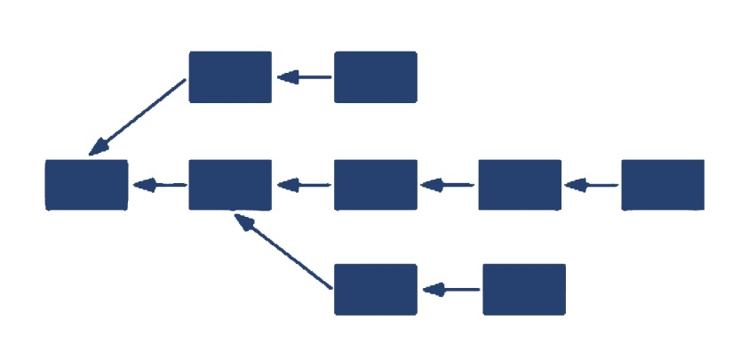
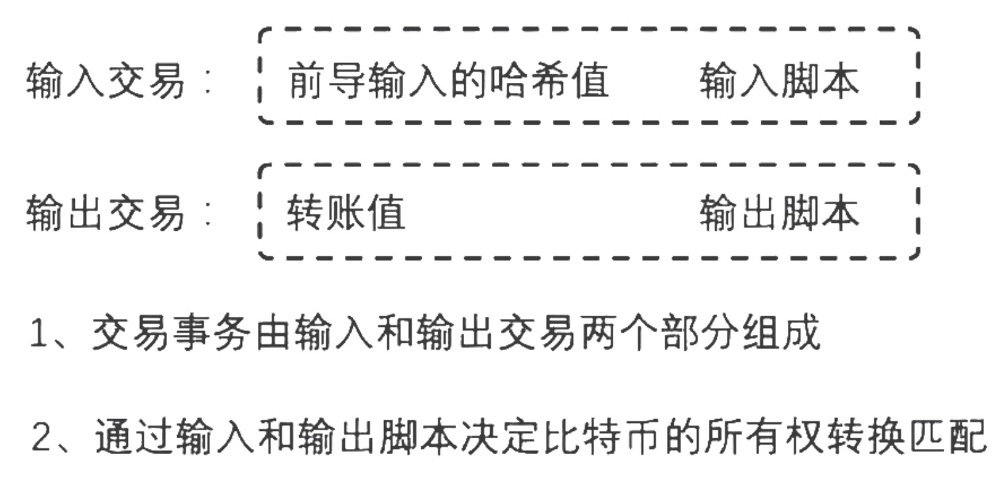
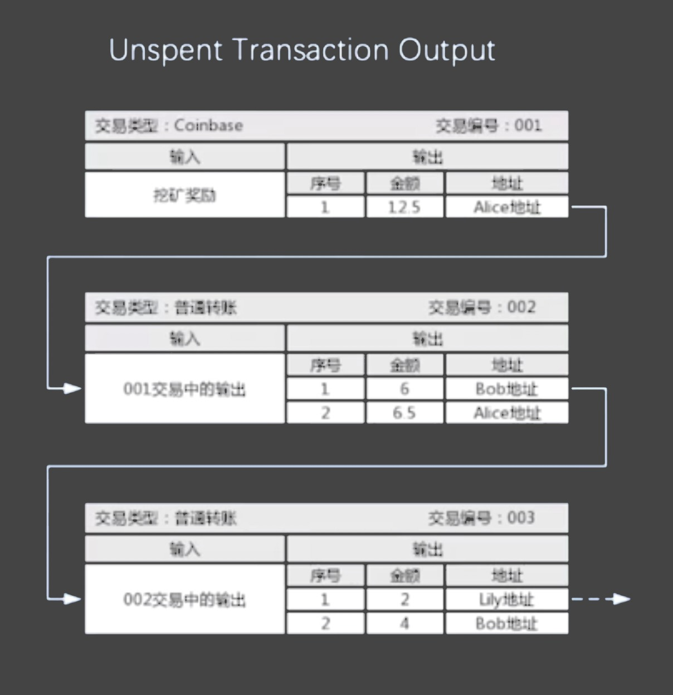
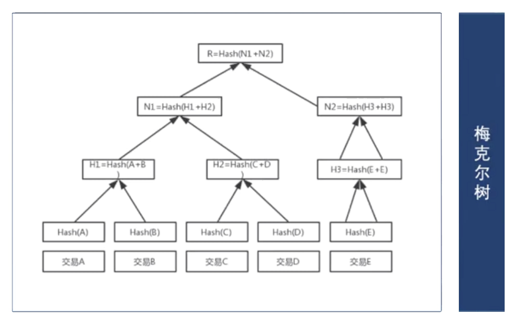
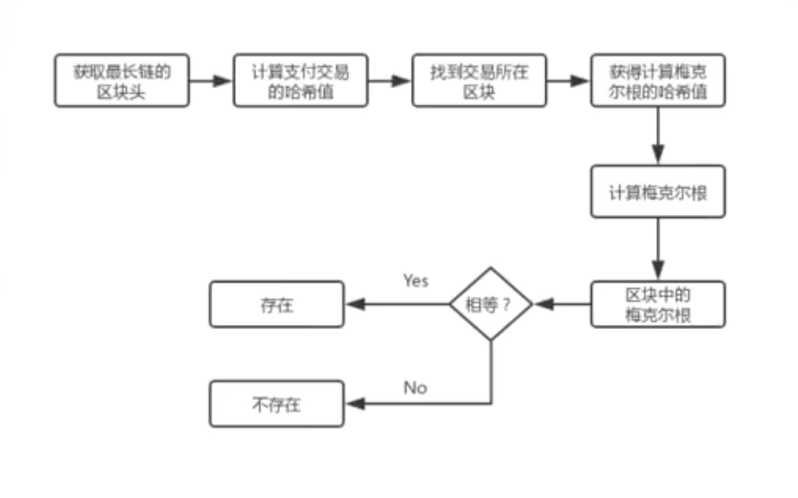

### 比特币主链

- 我们将站在比特币的角度来对区块链来进行一个更加具体的说明
- 区块链它只是一类技术的一个总称，而比特币是使用区块链技术开发出来的第1个典型的应用
- 因此我们对区块链技术的了解从比特币开始是一条必经之道
- 首先我们来看，何为比特币主链？
    * 比特币首先是一个区块链的网络系统，那么什么叫主链呢？也就是它主要的一个链，相当于是我们软件的一个正式版或者说是生产环境的系统
    * 因为区块在形成链的过程当中，并非只是一条单链，在这里其实分几种情况
    * 首先第1个，是测试链的概念，比如比特币为大家为社区提供了一个测试网络，相当于软件的测试版本，那么在测试网络里面呢，我们可以做任意的操作，不用担心有什么资产的损失或别的问题
    * 测试网络是相对于主链来说的一个测试版本
    * 第2种情况，区块在形成链的过程当中(在竞争打包的一个过程当中), 是会出现多个符合难度的区块的，因为在比特币里面是通过一种工作量证明来增强区块的打包权
    * 那么在全网争抢打包权的过程当中，并没有一个机制所限定同时只能是一个节点来，是有可能出现多个节点获得打包权
    * 那么这个时候呢，多个节点就有可能会产生多个都符合难度的区块
    * 那么这么一来，如图所示，它实际上是有可能在过程中产生这样的一个分叉的
    * 而在比特币里面，无论产生什么样的分叉(在中间临时产生分叉)，永远都以难度最大的那一条链来作为主链
    * 因此在比特币里面主链就是指正式的网络中，维持难度最大的那一条链，就是比特币的主链，也就是在比特币网络中真正有效的一条数据链
    * 其实这个我们也可以看到在区块链里面，它的这种特定的存储结构和共识机制，使得这种数据的存储不像传统中心化服务器一样是非常明确的，在这个过程当中是有可能会产生一些副本分叉等这些数据的
    * 因此在整个区块链网络中，什么样的数据才是真正有效的数据，往往就需要经过后续的区块的确认
    * 所谓难度最大也就是在后续的区块确认中维持一条链，在这个链中，挖矿难度是最大的，那么这个其实就是一个准则(协议)
    * 当然在其他的区块链系统呢，并不都是这种做法，那么这里就是以比特币为例，就是它的一个特点。

    

### 比特币节点网络

- 什么叫比特币节点呢？站在软件的角度，它其实就是指一组节点上的程序。
    * `完全节点` 英文叫 "full node" 也就是说在这个节点上它包含了比特币所有的功能和区块链账本数据，是比特币网络的一个主要的支撑，或者说是最重要的支撑。
    * 除了完全节点，其他有专门各个剥离出来的专有功能的节点，比如：
        * 专门负责去`挖矿的节点`(只保留了挖矿的功能)
        * `网络路由节点`，用来衔接各个不同的节点之间的p2p通信，那么它主要是负责数据的路由
        * `钱包`，当然钱包其实算不上是一个节点，不过也分情况，如果是那种跟完全节点来共同工作的那种钱包，叫完全节点钱包
        * 如果是一些轻量级的钱包(网页版、手机版等等其他形式的钱包)，这种钱包更多的其实是属于一种客户端，它要跟完全节点进行通信才能来进行实际的转账支付。
- 我们可以看到，在比特币的节点网络中，它的节点是分成很多种类型的
- 我们在部署的时候也可以把这些所有的功能都集成在一起，那就是综合性的节点
- 比特币节点网络需要很多个节点来通过点对点网络通信的方式来共同组成

### 交易事务的数据结构

- 比特币的功能是非常简单的，它主要是实现了一个类似于像银行里面交易转账这么一个系统(体系)
- 那么既然它实现的是交易转账，就存在着交易事务，那么交易事务到底是一个什么样的数据结构呢？
    * 它其实主要是由两个部分组成: 前半部分叫`输入交易`，后半部分叫`输出交易`
    * 我们可以看到在输入交易中，它包含了前导输入的哈希值，也就是对应着前面输入过来的哈希值，以及输入的脚本(一段验证程序)
    * 对输出交易来讲，首先包含的是转账的值(也就是转了多少)，以及输出脚本(一段验证程序)
    * 通过输入和输出脚本可以决定比特币的所有权的转换匹配，所以我们可以看到所谓的交易事务，并不是像完全像银行一样，只是转个金额，它是包含了验证脚本
    * 同时链接了前面的交易事务，实际上就像企业里面的仓储一样，有入库，有出库，出库必须对应着入库，那么这样环环相扣形成了这么一个链接
    * 我们可以看到不但是区块之间会形成这么一个链，在这个交易事物之间也形成了这么一个链，它也是通过这个哈希值来进行链接的，指向了前面的事务数据
    * 这个就是比特币的交易事物的一个基本结构

    

### 关于UTXO

- 我们来看一个更加具体的交易事务 --- UTXO: Unspend transaction Output (未花费交易输出) 
- 如下图第一个例子，相当于产生了一条交易事务，由输入输出两个部分组成
- Coinbase 相当于就是挖矿事务由系统奖励产生，而不是由别人转过来的，我们可以看到它输出了12.5个比特币到Alice的地址
- 接下来我们再来看交易编号002也就是第2条交易事务，这是一个普通的转账交易，它从Alice的地址开始转了，转到了Bob的地址
- 在输入中，它其实指向了001交易编号的输出，这就是为什么输入和输出是链接对应的一个关系(必须有之前的输出，才能有之后的输入)
- Alice向Bob转账，她转了6个，并且Alice的挖矿奖励是12.5个，这里转账6个给Bob，所以她要给自己找零6.5个，那么这样就形成了一个新的输入输出的关系。
- 而对于Alice来讲，在交易编号001里面通过挖矿奖励所获得的12.5个比特币，就是它可以用来花费的余额，也就是所谓的未花费交易输出，也就是UTXO
- 所以可以把UTXO看成是未花费的余额，只不过它不是一个余额这么一个汇总的数字，而是这样一条交易事务(输出事务)
- 我们在002里看到了Bob获得了6个比特币，接下来，Bob也向Lily来进行转账了，在交易编号003里面，我们可以看到Bob转了2个比特币给Lily，给自己又找零了4个
- 我们可以看到，通过交易编号001，002，003 首尾相连，这样链接的方式不断的完成输入和输出，输入和输出，而在每一次的输出中都包含了自己可以用于下一次输入的那个值，也就是所谓的UTXO
- 其实这个概念跟企业里面的仓库的入库出库还是非常的相似的，可以对比进行理解

    

### 区块中包含的内容

1 ）比特币中的区块头和区块体

- 比特币的区块中包含的内容是非常简单的：它由区块头和区块体组成 
- 在区块头里主要包含这6个字段：
    * `区块版本`：就是版本号，当前的协议和数据结构的版本，
    * `前一个区块哈希`：通过指向前一个区块哈希与前面的区块来产生一个链接
    * `时间戳`：就是指这个区块产生的时间
    * `梅克尔根`：就是指区块体中所有交易事务来计算出的一个哈希值，稍后会再详细的介绍
    * `难度值`：这个是跟比特币的挖矿相关的，在挖矿的过程当中，它其实就是通过对区块头进行连续的两次哈希计算来获得一个符合难度目标的值，这个难度值就是用来匹配这个挖矿的，符合条件的
    * `随机数`：也是跟挖矿相关的，因为我们需要使用类似于像暴力破解一样对区块头的数据进行连续不断的双哈希计算，在这个哈希计算过程当中呢，会不断的匹配一个随机数，来作为这个哈希计算的参数。当我们计算出的值符合区块中的难度目标值的时候，我们所采用的那个随机数就会被记入到这个区块头里面。
- 区块体就是一笔一笔的交易事务

    

2 ） **详解梅克尔根(树)**

- 要理解梅克尔根，我们就来看一棵树结构叫梅克尔树
- 假设我们这个区块里有5条交易事务，分别是：A、B、C、D、E, 
- 对这个5条交易事务分别计算它的哈希值，产生的A、B、C、D、E 5个哈希值
- 5个哈希值再两两结合，再一次来计算哈希值：A跟B结合，C和D结合，E只有自己，那就是自己跟自己再结合来产生了新的哈希值
- 新的哈希值再一次两两结合，直到计算出这个树根，在梅克尔树里面的每一个节点，每一个树的节点，其实都是哈希值，因此梅克尔树也叫哈希树
- 那么这个梅克尔根(或树)有什么意义呢？我们知道区块数据在比特币的节点中是需要进行不断的传递的，那么在传递的过程当中很有可能数据会发生损坏或其他问题
- 当某一个节点(接收节点)接收到区块以后，它会把区块中的交易事务再一次来计算这个哈希值来还原一下梅克尔树
- 那么如果计算出的梅克尔根和区块头中的梅克尔根不一致的话，那就说明获得的交易事务中某一条有问题了，那么这个时候我们可以通过梅克尔根来回溯到底是哪一条交易事务出的问题
- 比如说我们交易事务C有问题的话，通过梅克尔根来看，是N1和N2，哪一个哈希值出了问题呢？那么经过比较，假如说发现是N1这个哈希值跟原始的梅克尔树里面不一样
- 那么顺着这条线再来看，是来看是H1还是H2有问题呢，那如果发现是H2有问题，那么再按照这条线看是C还是D有问题
- 经过这样不断的回溯，就能以比较快的速度找到这个数据中其中某一块有问题的数据，这样就不需要重新下载整个区块事务数据，而只需要去下载对应的有问题的那一条
- 这个就是梅克尔树的作用，也就是说它是用来进行数据的完整性证明的，并且可以一种比较高效的方式来找到问题所在的数据块

    

3 ） **时间戳的验证规则**

- 通常在中心化服务器的软件体系中时间的问题基本上是比较容易解决的，因为时间可以统一来自于一个时间服务器(来自于服务器本身)
- 对于区块链系统来讲没有专门的服务器，当然我们也为比特币在网络中专门部署一个时间服务，也是可以的
- 由于比特币网络本身它还是一个点对点的这么一个网络架构，因此，每个节点所在的时区也是有可能不一样
- 在比特币中时间戳的验证规则：
    * 比特币里面一般来说没有专门的时间服务器，但是我们可以去部署这样的服务器来为比特币服务
    * 在比特币中新的区块的时间戳必须大于之前11个区块的平均时间戳，并且要小于未来两个小时
    * 这个就是比特币的一个时间戳的校验规则
- 由于在这种点对点的架构中，没法去统一的来获得某一个时间
- 因此只能有这么一个校验规则，来让它每个区块的时间戳不至于有很有很巨大的差异

### 挖矿的过程原理

- 挖矿在比特币里面其实是属于共识机制
- 对于点对点的这么一个网络软件，它的数据没有一个唯一的一个中心服务来做权威参照
- 就必须通过一种机制，每过一段时间，选出一个数据的打包者，以这个打包者打包的数据为准来与其他节点进行数据的同步一致性
- 谁来每过一段时间打包呢？在比特币里面是通过一个增强的机制，也就是工作量证明这么一个机制
- 这个工作量证明的过程就被形象的称之为`挖矿`，在这个过程当中，会需要消耗很大的计算机的算力来进行计算，就像挖矿一样是一种劳动
- 其实就是指不断的计算区块的哈希值(当然是做了两次哈希，双哈希)
- 我们是只指对区块头计算这个双哈希值，在区块头里面，不是每一个参数都是可调整的，比如说区块的哈希，时间戳，梅克尔根，等等
    * 在这些不同的参数中，梅克尔根是可以变的，因为如果我们调整了区块体里面的交易事务的数量或者说是顺序的话，那么这个梅克尔根就会发生变化了，所以梅克尔根也是其中一个参与计算的主要参数(参与挖矿计算或称哈希计算的主要参数)
    * 时间戳当然可以调，但是可调范围不是很大
    * 其他的参数的话，主要是随机数，相对来说可调整的范围比较大，它对这个计算过程来讲呢，更容易在大范围中来找到符合条件的这么一个值
- 那么不管是调整哪个参数，通过这种调整来进行计算，以使得结果匹配某个区块的难度目标值，一旦匹配成功，挖矿就算是成功啊，就算是结束了
- 所以所谓的挖矿过程就是指对区块头的组成参数不断的进行双哈希计算
- 在比特币里面，哈希算法主要是指SHA256这么一个算法

### 网络的最终一致性

- 所谓的网络的最终一致性的就是指比特币中每一个节点它们所拥有的自己的账本数据是不是都是一致的
- 比特币本身是会发生分叉的，很难通过一种特别明确的方式，使得比特币中的账本数据永远都时时保持一致，那么这个是很难做到的
- 另外，通过FLP原理，我们知道在互联网异步网络中，由于节点是可以随时宕机，损坏等等各种情况发生的
- 所以比特币网络中，它没办法达到一个实时确定性的一致性，而只能是达到一个最终一致性
- 比如说我们转账了一笔比特币，比如我们的这个转账事务纪录在了5号区块
- 这个时候我们会建议，如果要确保安全的话，就等待6个区块的确认，也就是说直到第11个区块产生以后，5+6=11，直到第11个区块产生以后
- 如果我们之前的交易事务仍然在主链中，那就说明基本上是没有问题了
- 当然这种没有问题也只是一个概率，只能说被篡改的可能性已经极低了，所以说只要是基于这种异步网络的，基本都是最终一致性而不是时时的确定性的一致性

### 关于SPV

- SPV: Simplified Payment Verification 简单支付验证
- 比特币网络对转账的交易事务会进行支付验证和交易验证，这两个是比较容易混淆的概念
- 支付验证：就是说我付了一笔钱(比特币)，主要是验证这个支付发生本身的一个合法性，比如说我的余额是否足够，我这个支付本身是不是合法
- 交易验证：是最完整的验证，会根据账本数据来进行最完整的一个验证。
- 对于支付验证来说，由于仅仅只是想证明这笔支付是否存在于区块中，那么它就没必要跟完整的账本数据来进行验证了
- 因为完整的账本数据往往随着时间的推移会非常大，比特币已经达到200多G的大小
- 那么对于支付验证，由于只是要验证一下这个支付的这个事务是否存在，因此，可以仅根据区块头来验证而不用根据这个全账本
- 这个SPV的验证过程：
    * 假如我们对某人产生了一笔比特币的支付，那我们现在来验证
    * 由于只会去获取区块头，不会获取区块体，因此，我们只能获得区块头里面那么几个字段的数据
    * 首先获取区块头(指获取最长链的区块头，就是难度最大的那一条链也就是指主链，也就是主链区块头)
    * 获得了区块头以后，我们来计算这个交易事务(支付交易事务)的哈希值，通过这个支付交易的哈希值查找这个交易事务所在的区块
    * 查到以后，可以获得计算梅克尔根的哈希值
    * 要想计算梅克尔根，一种方法是对每一个事物都要分别计算哈希值，然后通过这个一般性的步骤来进行计算
    * 第2种方式是我们获得了梅克尔树中间节点的哈希值，那就没有必要去对每一个事物一个一个的分别去计算了
    * 那么我们可以拎出树的其中一个分支，直接可以计算梅克尔根
    * 接下来，我们就跟区块头中的梅克尔根进行比较，如果这两者相等，那说明这个支付交易的事务是存在的，如果不相等，那就说明不存在
    * 这就是比较简单的支付验证

    

