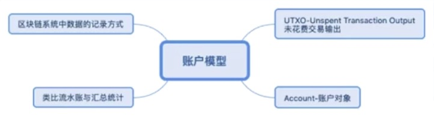
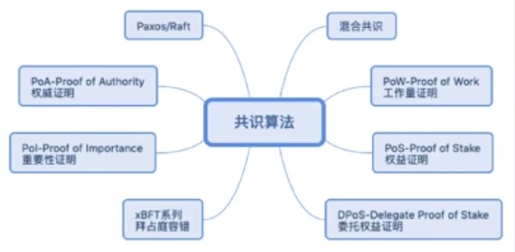
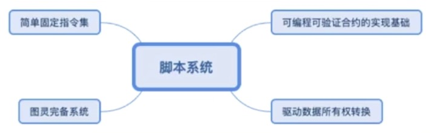
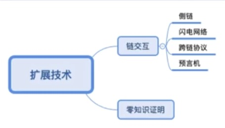

### 技术栈

- 从比较技术化的一个角度来对区块链进行一个阐述
- 从技术站的组成来来阐述一下区块链，作为一种软件系统的开发人员或者说是技术爱好者，更希望从技术的角度来进行一个理解，到底它包含哪些技术模块？又分别产生哪些作用？我们在开发区块链底层系统的时候，会涉及哪些方面呢？
    * `核心技术`：所有的区块链底层系统或者说是基础系统，基本上都包含这6大主要模块：`共识算法`，`密码算法`，`脚本系统`，`账户模型`，`区块链账本`以及`网络服务`
        * 作为一种账本系统，它当然首先要存储数据，那就离不开数据的存储，也就是`区块链账本`这个模块
        * 作为一种p2p的网络系统，那当然离不开网络服务，而且这边的网络服务也是特指p2p，也就是点对点`网络通信服务`
        * p2p的这样一个对等网络系统里面要保持每一个节点的数据一致，我们就需要一个共识机制，来提供这样一个数据一致性的保障，那就离不开`共识算法`
        * 对整个系统来讲，要保证区块链这样的一个链式的一个数据结构，以及对于其中的数据的签名验证等等，那也离不开`密码算法`，其实主要包含哈希算法以及公开密钥算法
        * 那么作为以整个系统来讲，因为系统总是仍在使用的，那如何来体现出这里面的账户呢？那就会包含一个`账户模型`，系统里面，他的账户模型是比较别致的，后续会做详细的阐述
        * 最后一个是`脚本系统`，因为在区块链系统中并不是一个静态的数据库，而是对于资产数据，以及一些智能合约等数据来进行一个所有权的转换以及验证，在这个过程中就使用到一个脚本系统也就是脚本指令环境，或者叫脚本编程环境
        * 这6大模块无论在什么样的区块链系统都会包含，只不过每一种不同的区块链系统，他对每一个板块的实现方式，设计模式，算法的选型上等存在一些差异而已
        * 以比特币为例，它的共识机制(算法)使用的是POW也就是挖矿或者叫工作量证明算法; 密码算法就是椭圆线密码算法以及哈希算法；脚本系统是相对固定的指令集，通过相对固定的指令系统来进行比特币的一个转发以及验证；账户模型，它使用的是UTXO这么一个模式；账本呢，它使用的是有这种key-value数据库进行存储，网络服务就是一般的P2P
        * 其他的区块链系统如：以太坊，Fabric，EOS等等也都是类似的
    * `扩展技术`：是在这个核心技术的基础之上，为了提升某些性能，为了扩展某一个方面的功能和扩展的一些基础板块，有：`预言机`、`侧链`、`闪电网络`、`跨链协议`、`零知识证明`
        * `预言机`, `闪电网络`, `侧链`以及`跨链协议`，它们解决的问题都是链之间，或者说是链与外部系统之间的数据的传递问题
        * 为什么在区块链里面链之间的数据传递或者说链与外部系统的数据传递需要使用这么多种做法？
        * 它在链内部所产生的数据都是经过共识而产生的，也就是说它的数据从产生开始就是一个可信的数据
        * 比如比特币的产生到转账，它的每一步都是在链内进行的，都是经过了节点的验证
        * 而链与链之间比如说比特币与莱特币之间，比特币与EOS之间，EOS与以太坊之间等等，这些链与链之间由于协议、对数据的验证方式等也不一样，如何仍然在一个保持可信的一个前提之下来完成数据的一个转移，那这就是闪电网络策略以及跨链协议所需解决的问题
        * 它们都是站在不同的技术角度以及不同的侧重点而设计的一些算法以及系统
        * `预言机`更多的是指区块链与非区块链系统之间的数据的获取，比如说链内的某个DAPP应用(比如说以太坊上面的某一个应用)，它要去获取外部数据库的一段数据，那么如何以可信的方式(可验证的方式)来获得一个可信的数据呢，这个就是预言机技术
        * `零知识证明`是与隐私相关的，比如说，我们希望在链上的数据是以某种隐私(某种加密)的方式来传递的，同时要在这种加密的前提之下，能够让节点依然能够进行一个正确的验证，这种技术就叫零知识证明。比如说，我们要证明某个人拥有拥有能够打开保险箱的密码，而我们又不想让对方直接说出那个密码，怎么办呢？
        * 这个时候对方可以这样，它让验证人站在远处，远到看不见那个保险箱的密码为止，而这个时候，他只要在验证者面前打开保险箱，那就证明他是知道保险箱的密码的，别人也并没有看到那个密码到底是什么，也就是说通过一种零知识的方式完成了证明
        * 这些都是区块链基础技术在里面的一些扩展技术，在设计开发区块链系统的时候，一般都是围绕着这些点来展开的

### 对等网络结构

    

- `对等网络`也就是指节点之间的层次结构是对等的，每两个节点之间都可以直接来进行通信
- 不像我们传统的这种中心化的服务器结构，它是没有一个中心的
- 区块链是一个对等网络而不是分布式网络，我们常常在很多的文章里也不区分这两者，实际上这两者之间是有着非常巨大的差异
- 分布式网络它本质上是一种服务器架构，比如说负载均衡, 计算云服务，是有一个明确的服务中心的，只不过，服务中心将一些计算任务，分布给其他的节点服务器进行计算，然后最终再把计算的结果汇总到服务中心。
- 区块链并不是这样的一种分布式的结构，它是一种对等的网络结构，每个节点之间都是做一样的事情，执行同样的数据处理逻辑，执行同样的数据验证逻辑，它不存在把某个数据或者说把某个计算任务分配给其他节点的分布式执行，然后再汇总
- 所以说这两者是一个完全不一样的概念，当然在区块链系统中，并不是说每一个节点必须要功能上完全一模一样，我们可以剥离出节点中的部分功能来单列为一个节点，比如说我们可以把网络路由功能单独出来，在网络中设立一个路由节点
- 那么这种情况之下呢，它仍然不是一个分布式网络，仅仅只是点对点对等网络中的某部分功能，以一个单独节点的形式来体现

### 密码技术

    

- 密码技术在区块链系统中是扮演着非常重要的作用，它主要是有两类算法来来组成：哈希算法和公开密钥算法，而零知识证明是密码技术的一类应用(而非算法)
- 哈希算法的几个应用场合
    * 对区块哈希的计算
    * 区块体中事务数据的哈希计算
    * 原子交换：是指区块链中两种不同的区块链系统中，它们的资产进行一个完整性交换的一种技术
        * 举个例子：甲方有10个比特币，乙方在以太坊上有100个以太币，甲方要把10个比特币去与乙方的100个以太币进行交换
        * 在这个交换过程当中，他要么就同时交换成功，要么就是大家都没有交换成功，而不能发生，比如说甲方转过去了10个比特币以后，但没有收到乙方的100个以太币
        * 那么会导致某一方的资产损失，这个过程就叫原子交换
            * 原子就是完整性的意思
            * 交换就是两种不同的资产的一个交换
        * 我们来看一下原子交换的一个步骤过程，甲方在把这10个比特币转给乙方之前，他先随机生成一个口令S，而且生成这个S的一个哈希值H
        * 甲方准备好了这两个数据之后呢，他就向乙方进行支付了，他支付10个比特币到乙方，但是他并不是直接进行的一个转账，而是带有条件去做的一个支付
        * 也就是说甲方发布了一个条件支付指令来支付10个比特币到乙方，有什么条件呢？
        * 乙方要符合什么条件才能得到这10个BTC呢？这个条件就是乙方必须要出具一个条件K，满足K的哈希值等于H，也就是说乙方得要知道那个随机口令
        * 其实条件K的有效值就是那个甲方的随机口令S？因为只有哈希同样一个原始文本才能得到同样的哈希值
        * 也就是乙方需要得到这个条件，那么当然，乙方这个时候也可以拒绝受理，他不参与交易，那就超时，也就是说这个条件其实带有一个时间有效期的
        * 过了这个时间有效期，比如是半分钟或5分钟等等，我们可以根据需要去设置有效期，那么一旦过了时间以后，乙方没有采取回应的处理
        * 那么这个甲方的这个条件支付呢，就回退，等于就是没有来发起这么一次转账交易，否则的话乙方要回应
        * 对于乙方来说，他就想知道甲方的随机口令S，但是甲方肯定不能直接就这样告诉乙方，一旦如果直接就这么告诉乙方的话，那乙方直接就获得了10个比特币，但甲方就不能保证乙方能够把100个以太币给他
        * 所以乙方也给甲方同样做了一个条件支付来支付这100个以太币给甲方，那么他也设了一个和甲方同样的哈希条件，他也做了这么一个转账支付，那甲方收到这个乙方的条件支付，他就得输入这个口令S(甲方当然他知道这个口令是因为之前自己设置的)。
        * 甲方输入了口令S以后就获得了乙方的支付, 同时系统返回了这个S作为回执给乙方，那么乙方也就得到了一开始的这个条件一的明文也就这个条件值
        * 于是在甲方获得乙方的100个ETH的同时，乙方也获得了甲方给他转了10个BTC，这就是整个原子交换的一个过程
        * 这里面只是把这么一个步骤给描绘了一下，具体的实现方式，我们比如说，比特币跟以太坊之间的交换的话
        * 我们可以在以太坊上面，编写一段智能合约，在智能合约里面，比如说我们可以把这个哈希值，以及原始文本作为一个if条件来进行判断
        * 甲乙都来调用这个智能合约，来进行一个原子交换的一个操作
        * 那么这个其实也是密码技术里面的一个很重要的一个使用
        * 我们可以看到其实通过这个哈希算法可以实现很多很有趣的功能
        * 那么应用在区块链里面，其实它的想象空间是非常大的
        * 这也是为什么我们往往称区块链里面的数字货币叫加密数字货币，特别强调了**加密**这么一个特点。

    

- 对公开密钥算法的使用主要是椭圆线密码算法，包括比特币、以太坊等等，很多公链或联盟链系统，基本上都是对椭圆线密码算法的应用，椭圆线密码算法的使用场景：
    * 主要是指对事务数据的哈希值进行签名计算
    * 还包括密钥交换，在两个不同的节点之间进行p2p网络数据交互的时候，需要在一个密文环境中进行数据交互
    * 我们就可以来通过密钥交换来形成一个共享的密钥，使得两端的节点都可以使用同一个密钥来进行数据的加解密以及所有权的验证
    * 所有权的验证是跟签名来一起来工作的，因为公开密钥算法是使用私钥签名的数据可以使用公钥来进行解密
    * 那么反过来也是如此，这就形成一个可以对数据的所有权身份进行验证的一个操作
- 密码技术在区块链系统中的几个比较重要的使用场合
    * 区块哈希的计算
    * 交易事务的科学计算
    * 以及在某些系统中，它还会更用来构建这个共识算法，比特币，以太坊，使用哈希算法来构建一个挖矿的这么一个过程
    * 生成账户地址，地址其实就是对应于私钥，一个私钥对应着一个公钥，而对公钥进行某种形式上的格式转换以后，就能形成账户地址，所以账户地址的生成也是基于密码技术的产生的
    * 构建交易所有权的匹配机制，什么叫所有权也就是签名，进行签名的一个证明，进行私钥签名以后，然后使用对应的公钥来进行匹配验证，看看是不是有由某个人的私钥签发的数据，这样就能构建交易的所有权，不单是交易，在区块链系统中并不仅仅是指交易数据，只要是区块链中定义的数据，它都是有所有权的，那么也都能使用私钥来签名，使用公钥来进行一个所有权力的验证。
    * 零知识证明，主要是由另外一些密码算法，包括哈希算法，哈希算法其实也是零知识证明算法的一种应用
        * 是指利用密码技术来构建一个证明的一个机制，使得不用知道原始数据是什么，而能够直接证明出对方是否拥有某一个原始数据，它是指这样的一类密码技术的使用。
        * 对于一段原始的文本来进行哈希计算之后，可以得到一个一一对应的唯一的一个哈希值
        * 那么在这种情况之下呢，我们要想来判断某个人是否拥有某一段文本的所有权，那么就可以看他能不能生成同样的一个哈希值
        * 在这种情况之下，其他的见证人或者说是见证节点，根本就不需要不知道原始文本具体的值是多少，也就是所谓的零知识
        * 只要看它的哈希值是否相等就能证明这个原始是否正确，那这个其实就是一个零知识证明
        * 在现有的一些区块链系统中比如: Zcash, 它就是一个对零知识证明有一个主要使用的一个区块链系统，也是一种数字货币
    * 除了这个哈希计算以外，还有其他的一些算法，比如说同态加密
        * 它一类密码算法，也就是对一段原始的明文进行加密以后，打个比方，对明文进行一个加减操作
        * 那它的效果在对密文上进行同样的加减计算，产生的效果是一样的，那么这个就叫同态加密

### 账户模型

    

- 账户模型在区块链系统是一个比较不好理解这个概念
- 通常在我们的传统系统里面，账户模型是不难理解的，比如说淘宝，微信，百度等等这些传统的互联网系统，都会有一个用户注册，用户登录这么一个功能
- 那么通过用户注册，我们注册一个用户名用户密码，那么就产生了一个账户，有了这个账户以后，所有在这个系统里面操作的一些数据都会关联到某个账户去，
- 这些是我们比较容易理解的概念，但在系统里面往往我们会发现并没有一个所谓的用户注册的这么一个过程，那么它是怎么来表示作为一个账户的呢？
- 首先在几乎所有的区块链系统里面，它的底层本质在于某个账户其实就是指一个账户地址，那什么叫账户地址呢？
- 它实际上就是指密钥，区块链系统通过比如说椭圆线密码算法，它可以产生一个密钥对，一个是私钥，一个是公钥
- 那么对于公钥我们可以进行一些哈希计算、base58编码，或截取其中若干个字节等等
- 总之就是经过一些我们设计的一些转换过程，最终得到一个字符串，那个串就叫做账户地址
- 对于比特币，我们说转账是转到某一个账户地址，那么这个账户地址就相当于是整个比特币系统里面的一个账户，一个账户模型
- 在比特币里面，它的一个账户模型，就叫UTXO, 这里我们可以简单的这么说，其实就相当于是一种流水账的记录方式
- 类似于我们企业里面的进销存中，假如说我们没有一个库存的汇总表，只有这个入库出库的一个流水账
- 这种方式我们可以就相当于就是UTXO的模式，就是它只有流水账，没有一个汇总表
- 那么另外一种账户模型呢？像是以太坊，它有一个账户对象，这个账户对象其实就相当于是一个汇总表
- 它不但保留了这个流水账，而且还设计了一个汇总表，并且这个汇总表里面的值关联了某一个账户地址
- 这两种方式的差别，简单的说其实就是，流水账与汇总统计这么一个差别，当然也可以同时保留这两种
- 汇总的这么一个做法呢，也可以看成是一种高级抽象，因为如果都只保留流水账的话呢，如果在统计的时候，就会变得稍微复杂一点。
- 因为我们需要去遍历这些一段一段的这些事务数据来得到一个汇总值，如果在链上本身就保存了这个汇总数据，对于外部的这个客户端来讲，比如说钱包客户端，区块浏览器等等，在获取某些数据的时候就比较容易来获得这些汇总数据，它主要是这两个概念的差别
- 所以说，账户模型简单说，本质上来讲，它就是指区块链系统中数据的记录方式，到底是只记录流水账，还是同时把汇总的也记录进去，主要是这么一个差别
- 但是不管两种方式的差别是如何，它的本质上仍然是账户地址，账户地址的在本质上来讲，那就是密钥对了
- 也就是说，在区块链系统中真正的底层账户的模式，它其实就是指一个密钥对

### 网络共识

    

- 共识算法它的一个作用呢，主要是在区块链的p2p网络中，用来维持每一个节点的数据账本的一致性的，也就是所谓的共识
- 共识算法发展到现在的，它有很多的分类:
    * 一、`POW`，也就是所谓的挖矿机制，比如比特币，以太坊等等，很多区块链系统早期都是使用的工作量证明机制
      * 也就是说通过某种算法，某种这个数学算法一般是指哈希算法，来匹配到某一个值，谁先匹配到，那谁就拥有打包权
      * 其他节点就以它打包的区块为准，来进行接收验证，也就形成了一个数据的共识，这是POW
    * 二、还有一类是`POS`, 也就是权益证明
    * 那么这两者有什么差别呢？
        * POW工作量证明，其实主要是指就是所谓的能者居上，多劳多得。先通过这个算力计算，来匹配到某一个目标值，谁就能够获得打包权
        * POS权益证明, 更多的并不是去看谁先通过暴力计算去得到这个打包权，而是根据权益来
            * 更加类似于像企业的股东会，不同的节点呢，拥有不同的权益，那么通过这个权益的大小，使得权益更大的拥有更多的概率来获得区块打包权
            * 当然权益证明其实是一个比较宽泛的概念
        * 无论是POW还是POS它并不是指一种具体的算法，而是一种思想，它是指一种算法的概念或者说是算法的思想，它本身并不是一种具体的算法
      * 我们利用这个POS也能够设计出一个POW的这样一个机制, 比如我们设计一个工作量证明算法机制
          * 这个算法里面有一个公式, 它的参数是每个节点拥有的权益
          * 那谁的权益大，谁就能够最先计算出某个目标值
          * 那通过这样的设计就能使用POS的思想来实现一个工作量证明(POW)
          * 所以不能把这个不同的机制看成一个完全独立隔离的概念
          * 这些都只是一些概念，它只是一种算法思想
    * 三、接下来再说`DPOS`, pose机制是指全员都能参与，那么DPOS的思想是什么呢？
        * 它是指很多节点可能对于参与共识不感兴趣
        * 可能更希望投票选举出一些代表节点来进行日常的区块打包, 也就是委托节点来进行区块打包
        * 这有点像企业里面就选出这个董事会的这么一个概念，由少数人来代表一下
    * 四、除此以外，`BFT`系列也就是拜占庭容错协议，它跟我们的POS这些在某些层面上的一些有点类似
        * 只要是叫什么pose啊，什么Dpose啊，我说什么BFT，大体上在实现方式上，都是通过一种投票选举的方式来，选举出一个区块的打包节点，这么一个过程
        * 那么这里为什么叫XBFT呢？因为它还有很多的变种，比如说有个PBFT(实用拜占庭容错)，还有SBFT(简单拜占庭容错)，还有叫DBFT(委托拜占庭容错、分布拜占庭容错)等等
    * 这些在区块链系统中使用最广泛的一些共识机制
    * 五、除此以外在某些特定场合，还有其他的一些应用，比如说`POA`(权威证明), 它通常是使用在某些测试网络中
        * 因为在测试的网络环境下，我们没有必要搞这么麻烦的一个共识机制，我们只是想来测试一下，除了共识以外其他功能是否正常
        * 什么叫权威呢？就是我们约定某几个固定节点来进行区块打包，所以叫权威证明，也可以叫重要性证明`POI`(Proof Of Importance)
        * POI它主要是指某个节点在获得打包权的这个过程中，除了像刚才说的一些什么算力，投票选举等等，还会考虑一些其他的因素
        * 比如说它持有的通证的多少，日常参与这个交易的一个频繁度，在线的时间的长短等等
        * 纳入了一些其他的更关心的一些因素，来决定某个节点是否能够获得打包权，这个叫重要性证明
    * 六、有时候会综合两种或者两种以上的共识算法，来形成一个`混合共识`
    * 七、那么除了这些以外，还有两种共识机制，更多的是使用在局域网环境之下：`Paxos`和`Raft`
        * 这两种共识机制更多的是使用在局域网或者说叫机房环境内部
        * 因为这两种共识算法，对于恶意节点不具备多少的抵抗能力
        * 本身它就是一个可信的环境之下的，像腾讯云，阿里云等等这些云服务环境之下的很多服务器集群就是在一个可信环境之下的
        * 那么因此他们就没有必要去使用那么复杂的一些共识机制，可以使用这两个
    * 其他的这些，尤其是像BFT，POS和POW系列，这些共识机制，更多的组织能够产生共识的这个效果以外，还能够对一些恶意节点能起到一个抵抗的一个作用
    * 八、其实还是有很多的`其他一些共识机制`的，只要我们围绕着它的2个特点设计就行了
        * 第1个：要使某个节点获得打包权
        * 第2个：像公链环境的话，需要能够一定程度上抵抗这个恶意节点

### 脚本系统

    

- 脚本系统在区块链中非常重要，如果没有脚本系统，那么区块链系统的将是一个静态的数据库系统，没法完成数据所有权的流动
- 它的作用之一：可编程可验证合约的实现基础，也就是所谓的脚本编程环境
    * 我们可以去实现自己的那个合约指令的协议，那么它是可编程的，也是一个可以被其他节点来验证的这么一个合约
    * 所谓的智能合约，它的一个底层的支持就是脚本系统
- 它的作用其二：驱动数据所有权的转换，这是一个比较总结性的概念
    * 像数字货币：比特币，以太坊等等，你要转账啊，那就得通过这个系统的这个脚本系统，来构建一条转账交易事务，来实现这个所有权的转换
    * 除了数字货币以外其他的数据，比如说我们基于链构建了一个溯源系统，构建了一个音乐版权的系统，或者构建了某种著作权，通证, 积分等这些转换交易系统
    * 它都需要使用脚本系统来完成这个所有权的转换
    * 当然它本身也需要配合其他的这个技术栈来共同完成，比如说密码技术
- 脚本系统有2种主要的实现方式
    * ①、`简单固定指令集`：比如在比特币系统里，它所能执行的指令是固定的，没有太大的灵活性
    * ②、`图灵完备系统`：像以太坊一样，支持了完整的可编程环境，利用这种可编程脚本环境，可以很灵活的实现自己想实现的各种业务逻辑
    * 这是两种实现方式各有优劣: 第①种，比较简单，也更安全，因为既然它是固定的一个指令集，就能够进行更加严格的验证, 第②种，相对完备的这么一个系统呢，更灵活也更容易编程，同时也有可能会带来更多的问题，都有一些优劣
- 简而言之，脚本系统是区块链系统中的业务逻辑驱动器，没有脚本系统就相当于汽车没有发动机(引擎)，无法运转

### 扩展技术

    

- 扩展技术是指除了组成区块链系统的几个核心技术栈以外，其他的为了增强某一方面的部分功能的扩展，设计出来的技术
- 这里两个比较重要的方向：`链交互`和`零知识证明`
    * 链交互就是链与链之间的数据交互方面的技术，比如：侧链、闪电网络、跨链协议、以及预言机，包括原子交换(也是一种链交互技术)
    * 事实上在侧链，闪电网络等这些实现的过程当中，其实也包含了原子交换的思想
    * 还有一个零知识证明，因为它是主要用来增强区块链系统中的数据隐私保护的能力
- 可以看的，所谓的扩展技术，其实主要是指区块链系统中特意用来增强某一方面的功能，延伸出来的技术
    * 当然其实除了这些扩展技术以外，其他还有很多种，比如说在区块链系统中账本存储的一个模块中，账本存储本身就能扩展出很多很多其他的技术呢，除了基本的k-v数据的保存以外
    * 我们还可以去实现一些比如像数据分片管理，或者其他的一些数据更高性能的存储方式
    * 对于密码技术来说，除了哈希算法，椭圆线密码算法，还有像一些抗量子密码算法，用来抵抗未来量子计算，量子破解的
- 每一个核心技术栈其实都能有一些扩展技术，那么当然我们这里特意列出的是不包含在核心技术里面，在某些功能方面，交互方面，隐私保护方面特意增强的

### 小讨论

- 区块链系统是什么样的网络结构?
- P2P网络系统必须要有一个共识机制吗？
- 请说出两种椭圆曲线密码算法?
- 比特币和以太坊在账户模型上有何差异？
- 闪电网络主要是利用了一个什么机制?