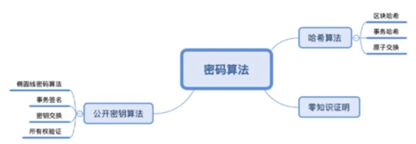
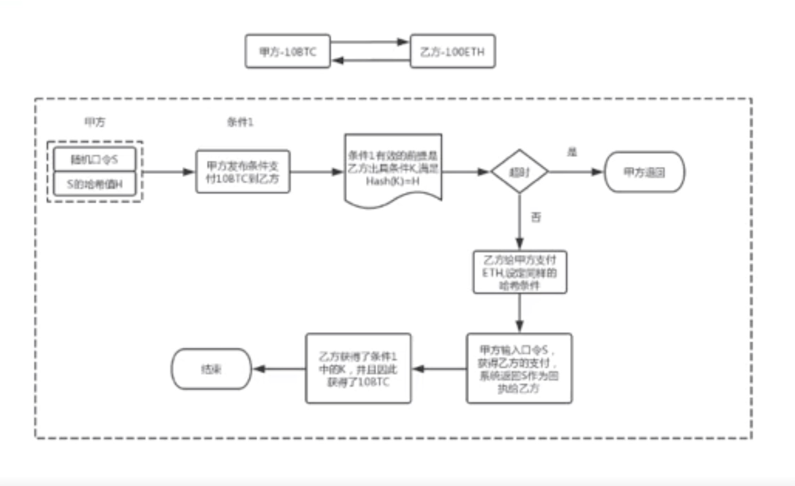

### 技术栈

- 从比较技术化的一个角度来对区块链进行一个阐述
- 从技术站的组成来来阐述一下区块链，作为一种软件系统的开发人员或者说是技术爱好者，更希望从技术的角度来进行一个理解，到底它包含哪些技术模块？又分别产生哪些作用？我们在开发区块链底层系统的时候，会涉及哪些方面呢？
    * `核心技术`：所有的区块链底层系统或者说是基础系统，基本上都包含这6大主要模块：`共识算法`，`密码算法`，`脚本系统`，`账户模型`，`区块链账本`以及`网络服务`
        * 作为一种账本系统，它当然首先要存储数据，那就离不开数据的存储，也就是`区块链账本`这个模块
        * 作为一种p2p的网络系统，那当然离不开网络服务，而且这边的网络服务也是特指p2p，也就是点对点`网络通信服务`
        * p2p的这样一个对等网络系统里面要保持每一个节点的数据一致，我们就需要一个共识机制，来提供这样一个数据一致性的保障，那就离不开`共识算法`
        * 对整个系统来讲，要保证区块链这样的一个链式的一个数据结构，以及对于其中的数据的签名验证等等，那也离不开`密码算法`，其实主要包含哈希算法以及公开密钥算法
        * 那么作为以整个系统来讲，因为系统总是仍在使用的，那如何来体现出这里面的账户呢？那就会包含一个`账户模型`，系统里面，他的账户模型是比较别致的，后续会做详细的阐述
        * 最后一个是`脚本系统`，因为在区块链系统中并不是一个静态的数据库，而是对于资产数据，以及一些智能合约等数据来进行一个所有权的转换以及验证，在这个过程中就使用到一个脚本系统也就是脚本指令环境，或者叫脚本编程环境
        * 这6大模块无论在什么样的区块链系统都会包含，只不过每一种不同的区块链系统，他对每一个板块的实现方式，设计模式，算法的选型上等存在一些差异而已
        * 以比特币为例，它的共识机制(算法)使用的是POW也就是挖矿或者叫工作量证明算法; 密码算法就是椭圆线密码算法以及哈希算法；脚本系统是相对固定的指令集，通过相对固定的指令系统来进行比特币的一个转发以及验证；账户模型，它使用的是UTXO这么一个模式；账本呢，它使用的是有这种key-value数据库进行存储，网络服务就是一般的P2P
        * 其他的区块链系统如：以太坊，Fabric，EOS等等也都是类似的
    * `扩展技术`：是在这个核心技术的基础之上，为了提升某些性能，为了扩展某一个方面的功能和扩展的一些基础板块，有：`预言机`、`侧链`、`闪电网络`、`跨链协议`、`零知识证明`
        * `预言机`, `闪电网络`, `侧链`以及`跨链协议`，它们解决的问题都是链之间，或者说是链与外部系统之间的数据的传递问题
        * 为什么在区块链里面链之间的数据传递或者说链与外部系统的数据传递需要使用这么多种做法？
        * 它在链内部所产生的数据都是经过共识而产生的，也就是说它的数据从产生开始就是一个可信的数据
        * 比如比特币的产生到转账，它的每一步都是在链内进行的，都是经过了节点的验证
        * 而链与链之间比如说比特币与莱特币之间，比特币与EOS之间，EOS与以太坊之间等等，这些链与链之间由于协议、对数据的验证方式等也不一样，如何仍然在一个保持可信的一个前提之下来完成数据的一个转移，那这就是闪电网络策略以及跨链协议所需解决的问题
        * 它们都是站在不同的技术角度以及不同的侧重点而设计的一些算法以及系统
        * `预言机`更多的是指区块链与非区块链系统之间的数据的获取，比如说链内的某个DAPP应用(比如说以太坊上面的某一个应用)，它要去获取外部数据库的一段数据，那么如何以可信的方式(可验证的方式)来获得一个可信的数据呢，这个就是预言机技术
        * `零知识证明`是与隐私相关的，比如说，我们希望在链上的数据是以某种隐私(某种加密)的方式来传递的，同时要在这种加密的前提之下，能够让节点依然能够进行一个正确的验证，这种技术就叫零知识证明。比如说，我们要证明某个人拥有拥有能够打开保险箱的密码，而我们又不想让对方直接说出那个密码，怎么办呢？
        * 这个时候对方可以这样，它让验证人站在远处，远到看不见那个保险箱的密码为止，而这个时候，他只要在验证者面前打开保险箱，那就证明他是知道保险箱的密码的，别人也并没有看到那个密码到底是什么，也就是说通过一种零知识的方式完成了证明
        * 这些都是区块链基础技术在里面的一些扩展技术，在设计开发区块链系统的时候，一般都是围绕着这些点来展开的

### 对等网络结构

    

- `对等网络`也就是指节点之间的层次结构是对等的，每两个节点之间都可以直接来进行通信
- 不像我们传统的这种中心化的服务器结构，它是没有一个中心的
- 区块链是一个对等网络而不是分布式网络，我们常常在很多的文章里也不区分这两者，实际上这两者之间是有着非常巨大的差异
- 分布式网络它本质上是一种服务器架构，比如说负载均衡, 计算云服务，是有一个明确的服务中心的，只不过，服务中心将一些计算任务，分布给其他的节点服务器进行计算，然后最终再把计算的结果汇总到服务中心。
- 区块链并不是这样的一种分布式的结构，它是一种对等的网络结构，每个节点之间都是做一样的事情，执行同样的数据处理逻辑，执行同样的数据验证逻辑，它不存在把某个数据或者说把某个计算任务分配给其他节点的分布式执行，然后再汇总
- 所以说这两者是一个完全不一样的概念，当然在区块链系统中，并不是说每一个节点必须要功能上完全一模一样，我们可以剥离出节点中的部分功能来单列为一个节点，比如说我们可以把网络路由功能单独出来，在网络中设立一个路由节点
- 那么这种情况之下呢，它仍然不是一个分布式网络，仅仅只是点对点对等网络中的某部分功能，以一个单独节点的形式来体现

### 密码技术

    

- 密码技术在区块链系统中是扮演着非常重要的作用，它主要是有两类算法来来组成：哈希算法和公开密钥算法，而零知识证明是密码技术的一类应用(而非算法)
- 哈希算法的几个应用场合
    * 对区块哈希的计算
    * 区块体中事务数据的哈希计算
    * 原子交换：是指区块链中两种不同的区块链系统中，它们的资产进行一个完整性交换的一种技术
        * 举个例子：甲方有10个比特币，乙方在以太坊上有100个以太币，甲方要把10个比特币去与乙方的100个以太币进行交换
        * 在这个交换过程当中，他要么就同时交换成功，要么就是大家都没有交换成功，而不能发生，比如说甲方转过去了10个比特币以后，但没有收到乙方的100个以太币
        * 那么会导致某一方的资产损失，这个过程就叫原子交换
            * 原子就是完整性的意思
            * 交换就是两种不同的资产的一个交换
        * 我们来看一下原子交换的一个步骤过程，甲方在把这10个比特币转给乙方之前，他先随机生成一个口令S，而且生成这个S的一个哈希值H
        * 甲方准备好了这两个数据之后呢，他就向乙方进行支付了，他支付10个比特币到乙方，但是他并不是直接进行的一个转账，而是带有条件去做的一个支付
        * 也就是说甲方发布了一个条件支付指令来支付10个比特币到乙方，有什么条件呢？
        * 乙方要符合什么条件才能得到这10个BTC呢？这个条件就是乙方必须要出具一个条件K，满足K的哈希值等于H，也就是说乙方得要知道那个随机口令
        * 其实条件K的有效值就是那个甲方的随机口令S？因为只有哈希同样一个原始文本才能得到同样的哈希值
        * 也就是乙方需要得到这个条件，那么当然，乙方这个时候也可以拒绝受理，他不参与交易，那就超时，也就是说这个条件其实带有一个时间有效期的
        * 过了这个时间有效期，比如是半分钟或5分钟等等，我们可以根据需要去设置有效期，那么一旦过了时间以后，乙方没有采取回应的处理
        * 那么这个甲方的这个条件支付呢，就回退，等于就是没有来发起这么一次转账交易，否则的话乙方要回应
        * 对于乙方来说，他就想知道甲方的随机口令S，但是甲方肯定不能直接就这样告诉乙方，一旦如果直接就这么告诉乙方的话，那乙方直接就获得了10个比特币，但甲方就不能保证乙方能够把100个以太币给他
        * 所以乙方也给甲方同样做了一个条件支付来支付这100个以太币给甲方，那么他也设了一个和甲方同样的哈希条件，他也做了这么一个转账支付，那甲方收到这个乙方的条件支付，他就得输入这个口令S(甲方当然他知道这个口令是因为之前自己设置的)。
        * 甲方输入了口令S以后就获得了乙方的支付, 同时系统返回了这个S作为回执给乙方，那么乙方也就得到了一开始的这个条件一的明文也就这个条件值
        * 于是在甲方获得乙方的100个ETH的同时，乙方也获得了甲方给他转了10个BTC，这就是整个原子交换的一个过程
        * 这里面只是把这么一个步骤给描绘了一下，具体的实现方式，我们比如说，比特币跟以太坊之间的交换的话
        * 我们可以在以太坊上面，编写一段智能合约，在智能合约里面，比如说我们可以把这个哈希值，以及原始文本作为一个if条件来进行判断
        * 甲乙都来调用这个智能合约，来进行一个原子交换的一个操作
        * 那么这个其实也是密码技术里面的一个很重要的一个使用
        * 我们可以看到其实通过这个哈希算法可以实现很多很有趣的功能
        * 那么应用在区块链里面，其实它的想象空间是非常大的
        * 这也是为什么我们往往称区块链里面的数字货币叫加密数字货币，特别强调了**加密**这么一个特点。

    

- 对公开密钥算法的使用主要是椭圆线密码算法，包括比特币、以太坊等等，很多公链或联盟链系统，基本上都是对椭圆线密码算法的应用，椭圆线密码算法的使用场景：
    * 主要是指对事务数据的哈希值进行签名计算
    * 还包括密钥交换，在两个不同的节点之间进行p2p网络数据交互的时候，需要在一个密文环境中进行数据交互
    * 我们就可以来通过密钥交换来形成一个共享的密钥，使得两端的节点都可以使用同一个密钥来进行数据的加解密以及所有权的验证
    * 所有权的验证是跟签名来一起来工作的，因为公开密钥算法是使用私钥签名的数据可以使用公钥来进行解密
    * 那么反过来也是如此，这就形成一个可以对数据的所有权身份进行验证的一个操作
- 密码技术在区块链系统中的几个比较重要的使用场合
    * 区块哈希的计算
    * 交易事务的科学计算
    * 以及在某些系统中，它还会更用来构建这个共识算法，比特币，以太坊，使用哈希算法来构建一个挖矿的这么一个过程
    * 生成账户地址，地址其实就是对应于私钥，一个私钥对应着一个公钥，而对公钥进行某种形式上的格式转换以后，就能形成账户地址，所以账户地址的生成也是基于密码技术的产生的
    * 构建交易所有权的匹配机制，什么叫所有权也就是签名，进行签名的一个证明，进行私钥签名以后，然后使用对应的公钥来进行匹配验证，看看是不是有由某个人的私钥签发的数据，这样就能构建交易的所有权，不单是交易，在区块链系统中并不仅仅是指交易数据，只要是区块链中定义的数据，它都是有所有权的，那么也都能使用私钥来签名，使用公钥来进行一个所有权力的验证。
    * 零知识证明，主要是由另外一些密码算法，包括哈希算法，哈希算法其实也是零知识证明算法的一种应用
        * 是指利用密码技术来构建一个证明的一个机制，使得不用知道原始数据是什么，而能够直接证明出对方是否拥有某一个原始数据，它是指这样的一类密码技术的使用。
        * 对于一段原始的文本来进行哈希计算之后，可以得到一个一一对应的唯一的一个哈希值
        * 那么在这种情况之下呢，我们要想来判断某个人是否拥有某一段文本的所有权，那么就可以看他能不能生成同样的一个哈希值
        * 在这种情况之下，其他的见证人或者说是见证节点，根本就不需要不知道原始文本具体的值是多少，也就是所谓的零知识
        * 只要看它的哈希值是否相等就能证明这个原始是否正确，那这个其实就是一个零知识证明
        * 在现有的一些区块链系统中比如: Zcash, 它就是一个对零知识证明有一个主要使用的一个区块链系统，也是一种数字货币
    * 除了这个哈希计算以外，还有其他的一些算法，比如说同态加密
        * 它一类密码算法，也就是对一段原始的明文进行加密以后，打个比方，对明文进行一个加减操作
        * 那它的效果在对密文上进行同样的加减计算，产生的效果是一样的，那么这个就叫同态加密