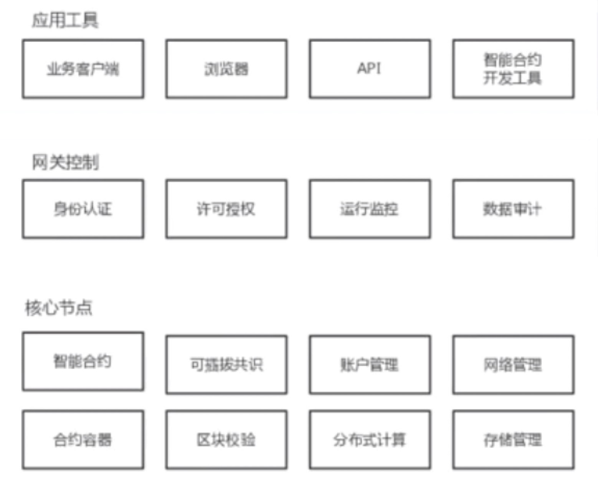
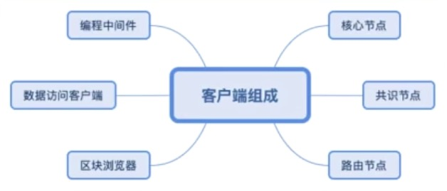
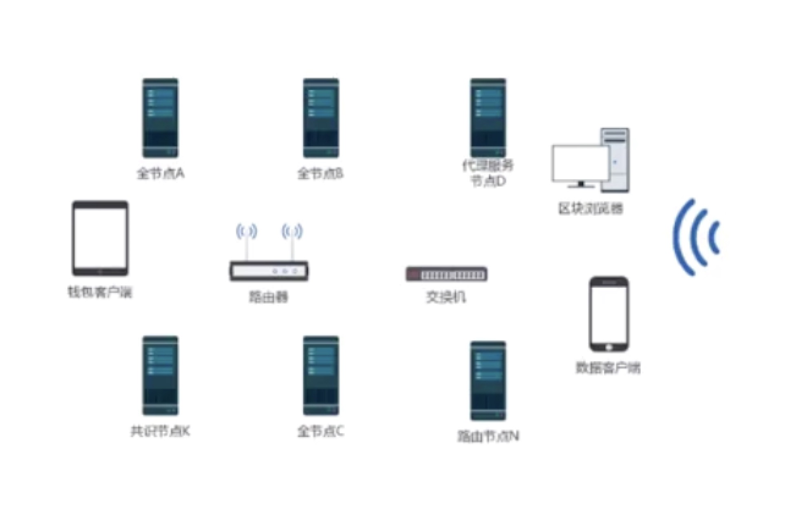
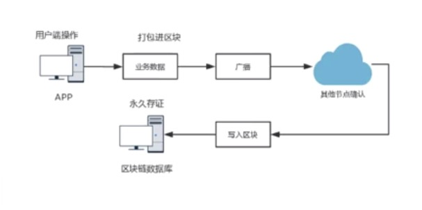
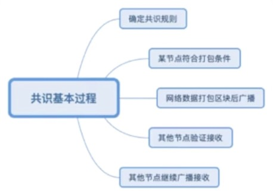
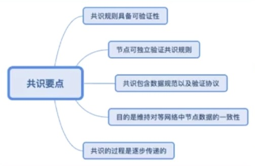
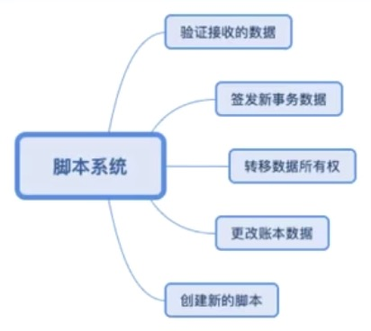

### 系统架构

    

- 在这里大概列举了一下，对于一个区块链系统可能包含的多种模块
- 这些是一个区块的基础系统的一个架构组成
- 它包含这些`核心节点`，核心节点里面，就是一些基础技术栈，或者说是核心技术栈的一些实现
    * 账户、网络、账本存储、校验、脚本系统、智能合约这些实现
    * 以及可能进行的分布式计算，因为我们在某些场景之下，有可能在p2p的这种系统环境中，在这个节点上，去实现一些分布式计算
    * 在核心节点里面，基本上就是包含了对核心技术的实现
- 再往上一层就是`网关控制`，包括身份认证，许可授权，数据审计等等
    * 并不是说所有的区块链系统都会包含着这里所有的成部分
    * 比如说对于公链来讲的，它一般是不需要审核认证的，比如比特币
    * 我们要使用的话直接下载节点进行运行就可以了
    * 当然这个是相对而言的，比如说对在以太坊上面实现的一些智能合约
    * 在这个智能合约内部，我们可以内置一个身份认证的功能，许可授权的功能
    * 对于公链本身，我们没有这个控制，但是对于某个合约本身的逻辑，那有可能是需要这些授权认证的
    * 所以这里面我们要注意对它的一个本身的理解，并不是说，在区块链系统中必须要具备某一块功能，必须不具备某一块
    * 它是根据我们对区块链技术系统的一个设计来进行安排
- 最上层的`应用工具`主要是指一些客户端，比如说：业务客户端，钱包客户端、浏览器客户端，以及智能合约的开发工具，还有一些API，也就是对这个节点功能接口的调用
- 这些就是我们系统的一个简单的一个架构示意图
- 在具体实现我们的自己的区块链系统的时候，要根据这个功能的一个设计需求来进行具体的设计，并不是说这里的每一个板块都是需要具备的

### 客户端组成

    

- 区块链系统它是一种软件系统，那既然是一种软件系统，它就有具体的一个客户端的一个组成形式
- 它到底是有哪些这个软件客户端来组成的呢？
    * 比如说`核心节点`，组成区块链网络的就是核心节点
    * 在某些情况之下，我们也可以把专门负责数据共识的节点，给独立出来叫`共识节点`
        * 比如说像比特币其实就是这个应用的，它有专门的矿机负责打包，那其实就是一个独立的一个共识节点
    * 还有专门用来实现路由功能的节点，叫`路由节点`
        * 路由节点不对数据本身来进行全节点的验证处理，而仅仅只是用来增强网络本身的路由能力
        * 用来记录一些不同节点的IP地址，端口等等，那么它是用来增强网络路由功能的
    * 以及其他的，如`数据访问客户端`，`区块浏览器`等，一些其他的用来用来访问这些区块链的核心节点的工具
    - 包括一些`编程的中间件`：sdk开发包，模拟器，某个核心节点的一些模拟系统等等，包括编译器，智能合约编译器等等
- 整个客户端组成其实细分的话还是可以包含很多种类型的
- 所有这些组成了我们一个区块链系统的产品生态
- 实际的客户端类型其实是远不止这6种的，根据需要我们可以不断的扩展出其他的一些应用客户端

### 网络拓扑结构

    

- 区块链系统的网络拓扑结构是：p2p对等网络
- 我们再来看一下它的p2p的网络结构里面会有哪些东西组成
    * 全节点：功能最丰富的节点，它既包含完整的账本数据，也包含完整的技术栈
    * 代理服务节点：除了这个全节点的功能以外，为了向其他人提供更丰富更方便的一些访问功能，那么它会在在全节点的基础之上再增加一些访问层的功能
        * 比如说，很多人可能不愿意去同步完整的账本数据，不愿意去维护一个全节点
        * 那么代理服务器就可以来做这个事
        * 代理服务节点的本身就是一个全节点，同时向大家提供了一个服务接口，方便大家以一种安全的形式，以一种安全的方式来进行节点数据的访问
    * 以及包括像其他：路由节点，共识节点，区块浏览器，钱包客户端，数据客户端，以及形成整个网络的路由器，交换机等等
- 整个这些都组成了一个网络拓扑结构

### 共识原理

1 ） **基本原理**

    

- 在整个区块链系统中，共识原理是一个比较重要的部分
- 用户端操作，比如通过某一个客户端来发起的业务数据的操作，比如说转账，某个智能合约的部署，某个合约里的方法的调用等
- 这些业务数据将被某一个获得打包权的节点打包进区块，它再继续进行广播，广播给网络中其他的节点，其他的节点也会进行一个验证和确认
- 确认无误之后就写入自己的区块账本数据中最终完成一个永久的存证，形成了一个区块链数据库
- 这个就是共识的一个基本工作过程，可以看到整个共识的基本过程，其实就在于广播跟其他节点确认这么一个部分
- 从打包到广播，到其他节点确认到整个网络的一个共识

2 ） **共识基本过程**

    

- 共识的基本过程包含哪些方面呢？
    * 要确定一个共识规则，使用什么样的规则来进行共识？POW, POS, BFT, 或者还是某种混合机制等等
    * 确定以后，某个节点就能够通过这个共识的规则，它就会获得打包权，也就是某节点符合打包条件
    * 网络数据将被打包进区块后进行广播，其他节点进行验证接收，然后其他节点继续进行广播以及其他节点的接收
- 这个就是共识的一个基本的工作过程

3 ） **共识要点**

    

- 共识要点是什么呢？
    * 首先我们所设计的共识规则，必须具备可验证性，什么叫可验证性呢？
        * 我们对区块打包权的验证是每一个节点都能参与验证的
        * 比如说工作量证明，它是不是计算出了某一个符合条件的数据
        * 权益证明它是不是拥有符合条件的权益
        * 它必须是可验证的
    * 节点可独立验证这些共识规则
        * 因为在p2p网络中，我们是假设网络是不可靠的，而且是没有一个服务器的
        * 所以我们不能去设计一个在这个验证共识规则的过程当中，需要节点之间进行频繁大量的数据交互
        * 如果是那样的话，那这个共识过程很可能会经常完不成
        * 也就是说我们必须让这个节点可以独立的验证，它通过自己账本中的数据，就能够来验证这个共识规则
        * 比如说像工作量证明里面，我直接通过这个难度值，以及这个当前区块的数据，我就能独立的来验证了
        * 在验证过程当中并不需要去跟其它节点有过多的交互
    * 共识的过程是包含了数据的规范以及验证协议
        * 数据规范，比如说我们所接收到的事务数据或者说区块数据，必须是符合我们定义的数据规范的
        * 同时我们怎么来验证呢？每一个节点的验证协议也是必须要一致，否则的话就达不成一致了
    * 共识的过程它的目的是维持对等网络中节点数据的一致性
        * 这是我们设计共识算法的一个目的，要始终牢记！
    * 共识的过程是逐步传递的，为什么这么说？
        * 因为p2p网络中的节点是随时可以加入网络，也是可以随时退出网络的
        * 并且这个网络中的节点数量有多少我们也不得而知
        * 假如说是遍布全球的话，那么在整个这么一个数据传递以及数据验证的这么一个过程
        * 它就像一个波动过程一样，会逐步的传递到每一个节点，它是这样的一个过程
- 我们一直都是在这样一个p2p网络过程当中，为了维持数据的一致性，设计的共识机制，这些就是关于共识机制的一些设计要点

### 脚本系统原理

    

- 脚本系统的一个工作过程，其实主要是包含几个方面:
    * `验证接收的数据`，其实这个是属于共识的一部分，我们可以看到某一个功能往往并不是独立工作的，几大技术模块是配合工作的
        * 通过脚本系统本身的指令，来执行验证的过程，来完成验证接收的数据
    * `签发新的事务数据`，比如说新的转账交易事务，新的这个数据存证的事务等等
        * 使用私钥签发就是构造一个新的事务数据
        * 而新的事务数据要包含一些验证功能，那就使用到脚本系统
    * `转移数据所有权`，转移的过程就包含签发新事务数据以及对这个事务数据的验证接收
        * 通过这个过程来完成数据的所有权的转移
    * `更改账本数据`，当我们要实现对区块账本数据进行修改，删除的时候
        * 要注意到，并不是说区块链系统就一定是完全不可篡改的
        * 它是有条件的，我们只是说当区块链系统的节点网络足够广泛的时候，它的数据的可篡改性就变得很困难
        * 但并不是说区块链系统中的数据是不能篡改的，它仍然是可以被更改的，只是往往这种更改是有一些条件的
        * 比如它需要私钥签名，通过私钥签发一条数据的修改指令
        * 当然这个数据修改指令需要这个区块链系统本身支持，如果区块链系统本身不支持这种更改的这种操作的话，那也就无法来进行这种更改了
        * 那么这个更改的过程当然也是要通过脚本系统来进行执行的
    * `创建新的脚本`，我们在这个脚本系统中可以使用某些特殊的脚本功能来创建新的脚本，也就是创建新的合约
        * 其实像以太坊这种，在以太坊的脚本系统里面创建一个新的合约脚本系统
        * 这个就是典型的一个例子
- 这些就是脚本系统的工作原理
- 脚本系统就相当于是区块链系统中的一个驱动器, 它驱动着这些数据的流转

### 小讨论

- 区块链系统必须是要具备一个经济模型吗？(所谓的经济模型也就是所谓的token, 通证，有时候也叫代币，它是不是必须要去给一个这样一个东西）
- 区块链账本中的数据，一定是不可篡改的吗?
- 全节点与路由节点具体是什么差别？
- 在脚本系统中可以创建新的脚本系统吗？
- 图灵完备的脚本系统在区块链中有何问题?