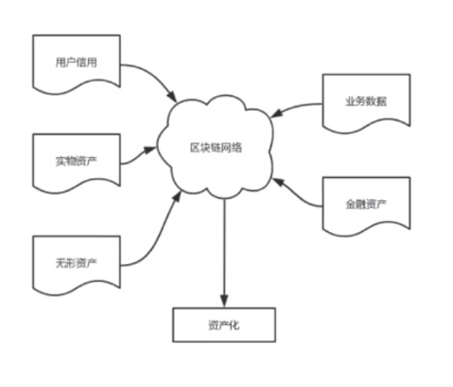

### 数据资产

1 ） **详解**

- 这是区块链的一个比较核心的应用，对于软件系统或者说对于互联网系统来讲，对数据的处理、分析、计算，这些功能是属于比较基本的软件功能
- 对于区块链来讲它的核心的功能是在于创新式的提供了一个原先各种软件都没有能够实现的功能，那就是数据资产
- 什么叫数据资产？顾名思义就叫数据的资产化，或者说某种具备资产性质的数据

    

- 上图中间代表一个区块链网络，在这个网络的四周可以看到有：用户信用，实物资产，无形资产，业务数据，金融资产等
- 上面四周的这些都是一些无形的数据，当然还不能说它是资产
- 如果说实物资产以及金融资产本身算一种资产的话，那么像业务数据，用户信用等这些，它本身它只能说是一种数据而不是一种资产
- 当它们通过区块链来进行公正，进行一个可信的公证确认的时候，就具备了一个资产的性质
- 我们知道什么叫资产，就是拥有一定的价值的，并且可以去量化它的某种实物或无形的东西，它是可以拥有一个标准化的定义
- 对于区块链来讲，它的一个特性就是可以把那些生活中各种各样的或者是资产或者还只是数据的这些东西，通通可以把它实现成一个链上的数据资产
- 为什么可以实现呢？
    * 因为对于区块链来讲，它所具备的主要功能就是实现一个可信网络，实现一个价值传递网络
    * 当一个数据具备一个价值传递的存在的时候，它就具备了一个资产的性质
- 从技术上来说，它就是区块链中的一段程序以及数据，就比特币来说，在软件角度它也就是一段程序和数据
- 在这些年的发展过程当中已经形成了一些事实上的标准，如：ERC20/ERC875资产，这些所谓的资产其实就是一组数据以及软件的接口标准
- 这个是在社区发展过程中，逐步形成的一种事实上的标准
- 当链外的数据，不管它原先是什么样子，当它到链上的时候一定会是一种比较标准的形式来呈现
    * 这些标准的数据，标准的程序，在链上经过公证，确权，经过价值的一个传递，一个背书
    * 它就具备了一个数据资产的一个特征
- 实际上在区块链里面，我们通常还并不直接称呼`数据资产`，有一个更加通用的称呼叫`通证`
    * 所谓通证就是指：对现实生活中各种已经可以资产化的数据进行的一个抽象
    * 对这种可以相信的，有信用的一种量化以及数字化
    * 在区块链里面，不单是所谓的数字货币，或者说是数据资产
- 假如说我们在区块链中实现一个业务系统：进销存，追踪溯源系统，积分系统，某种表单业务系统
- 当这些系统上的数据在链上进行传递的时候，由于链上具备一个公正性，不可篡改，价值传递的能力，当它具备这些背书的时候，它就具备了一种信用
- 也就是说我们可以来信赖这个数据，我们可以相信这个数据
- 比如，在区块链中我们可以看到的各种数字货币，以及现在出现的很多泛化数据资产，那为什么它会有价格有价值呢？为什么它会让人们去相信？
- 说到底其实就是通过区块链这样的一个技术，这样的一个网络来负载了一层信用，而这个信用并不仅仅只是一个概念，形容词，描述，它是一种量化以及数字化
- 那么如果我有一个数据在链上进行传递的时候，如何去量化和数字化呢？
    * 数字化是相对来说比较容易的，那就是把各种各样的数据已在链上定义的标准格式，以及与它相应的一些处理规则，把它存证在链上
    * 量化就是当所有的这种各种各样的数据，资产进行一个量化以后进行上链以后，实际上它已经被抹除了本身各种各样的差异，我们统称为通证
    * 这样就能把它抽象化和量化
- 在生活中，比如我们的书籍，电脑，车子，房子，这些具体的实物，它的形状，特点都是不一样的，那怎么来对这些不同的资产来进行一个统一标定呢？
    * 生活中我们通过货币来量化
    * 在链上也一样，把各种各样的资产，数据，在上链以后实现一个通证化，使用通证这个工具进行量化并且产生一个标准的计量方式
- 区块链中很重要的功能并不仅是说把生活中的资产来映射到链上去，它的一个更加重要的功能是把生活中的某些数据(本身算不算资产)进行上链资产化
    * 比如个人信用，个人数据
    * 企业拥有的在业务过程当中产生的数据(交易, 采购, 销售等过程中产生的一些信用, 长期积累的数据)
    * 这些东西原本只能算是一个数据，达不到资产的一个级别
    * 对于区块链来讲，它的一个核心功能在于能够把这些数据给资产化，进而使得这些资产化的数据再通证化
    * 从而在链上使用通证这个工具，对它进行量化，数字化以及计价
- 这个就是数据资产的一个应用

2 ）**思考**

- 数据资产化的技术支持是什么？(为什么区块链可以来实现数据的资产化?)

### 交易系统

1 ） **详解**

- 交易系统也是区块链里面的一种应用类型
- 典型案例：以德系统、0x协议、比特股
    * 以德是建立在以太坊公链上的一个去中心化的一个交易系统，这里的去中心化有一定的前提的，它是通过以太坊的智能合约来实现的一个交易系统
    * 0x协议是在链上实现交易系统的协议
    * 比特股本身它是一条公链，实现了一个交易系统(数字资产的交易系统)这样的一个功能
- 不管是哪一种方式都是通过发布在链上的合约来进行数据资产的转换
- 不管是什么样的交易系统，最基本的功能无非就是对于不同的资产来形成交易对，之后进行一个买卖
- 买卖之间产生一个撮合价格，买卖双方完成自己的买单和卖单的处理
- 基于这样的一些功能可以在链上通过合约的形式或者说通过一些专门定义的指令脚本来实现这样的功能
- 对于区块链系统来讲，由于它的一些特点是数据的公开透明以及不可篡改，对于实现交易系统来讲可以增强它的可信性
- 对于中心化的交易系统，至少在技术层面上，我们是不能完全相信它的，因为一个中心化的系统，可能会存在一些内幕操作
- 对在链上的交易系统，由于每一笔都是在链上产生，而且是记录在这个区块账本里面，即使有人操控也是非常容易被发现
- 这是交易系统在区块链上面的一些应用
- 目前我们用户真正使用的交易系统，并没有广泛上链，因为它存在的一些问题
    * 如性能不是特别高
    * 由于链上的数据的公开透明，更容易被人探测到一些买单卖单
    * 所以这类场景下的应用不高
- 作为一种应用来讲，我们可以去尝试，基于区块链，p2p网络，基于这样的一种场景之下，实现一个更加具备可行性的一种交易系统

2 ） **思考**

- 对于链上的交易系统，它会有哪些问题呢？

### 即时通信

1 ） **详解**

- 我们日常使用的微信，QQ等等都是一些即时通讯的软件工具软件服务，在这里我们指的是在区块链上实现的即时通信
- 对于链上的即时通信系统主要使用的是两类技术
    * `p2p网络`
        * p2p网络是没有服务器的，p2p网络就是对等网络系统
        * 对等网络系统的节点都是平等的，不管是直接点对点的通信还是通过节点的转发，没有一个固定的服务器
        * 这里可以首先达到一个隐私保护和防止了一些网络攻击
    * `非对称密码技术`
        * 我们无需想到去注册一个用户，而是使用这个非对称密码技术(比如椭圆线密码算法)，每一个用户可以为自己来生成一对密钥
        * 一对密钥是指生成一个公钥和私钥，公钥是公开出去给别人，别人可以通过公钥加入自己的好友中
        * 当自己使用时要签名(加密)的数据来进行发送以后呢，对方可以使用我公开的公钥来进行的验证
        * 我要给对方发信息，可以使用对方的公钥来进行加密，对方收到以后，使用相应的自己的私钥来进行解密
        * 这种方式就实现了一个身份识别和隐私保护
        * 在整个这个过程当中，都是以密钥对的形式存在，而不是以用户名等与用户的真实身份相关的信息出现
        * 这种方式呢可以更好的实现隐私保护的通信
        * 在这样的一个网络系统中实现的即时通讯，用户的身份本身是不会体现在这个系统里
        * 每一个人在这个网络中，他唯一的一个身份表示就是密钥
        * 对于一个密钥来讲，我们是无法看着一个密钥就知道是谁，更何况用户可以随时更换自己的密钥
    * 通过这2点，我们可以来实现即时隐私通信
- 对于区块链来说，p2p网络以及非对称密码技术，都是属于区块链的一部分，对于即时通信在区块链的实现
- 如果只是使用这两者的技术，显然我们看起来并不并不一定需要区块链技术，p2p网络和非对称密码技术这些是早就有的
- 区块链可以为我们实现一个经济模型，虽然是点对点网络，但是在网络中也得要有节点才行
- 那些节点为什么会愿意运行在网络中，这就需要一个经济模型
- 显然这个经济模型并不能通过一个机构，或者一个服务型的实体来支持，如果是那样的话，又回到了传统的模式
- 我们现在可以通过区块链来实现经济模型，而通过经济模型呢，使得这一个个的节点就获得了经济的支持
- 就可以确保网络的一个自治运行

2 ） **思考**

- 仅仅实现无服务器的通信是一定需要区块链吗？

### 链上游戏

1 ) **详解**

- 游戏在软件里面是占有很大的一个重要板块，区块链作为一种平台，当然也可以来实现一些游戏
- 最典型的游戏就是加密Kitty猫，那么这是一款在2017年年末的时候，出现的一款基于以太坊智能合约的一个游戏
- 它可以通过合约来生成不同的猫，两只不同的猫之间的就可以生成下一代的猫，并且这些猫还可以用来进行交易，当时是非常的火热
- 基于链上的一个游戏，它有哪些特征呢？
    * 实现游戏的无服务器化，区块链是一个p2p的网络，没有服务器，所以在区块链上面的游戏也就是游戏的无服务器化
    * 实现游戏数据的资产化，通过链可以把数据资产化，同样的在区块链游戏里面所产生的数据自然也就可以实现游戏数据的资产化
        * 可以更加方便用户去进行游戏数据的一些交易买卖，增强游戏的数据流通能力
    * 可以开创具备区块链特征参数的游戏，区块链里面是有一些不同于其他软件的一些很特别数据参数的
        * 比如区块高度，区块头的哈希值，区块中的难度值，随机数等这些数据
        * 这些数据随着区块的不断的增长，每一个区块基本都是不一样的，通过这个特征就可以去实现一些很有意思的功能
        * 比如可以判断当到达某个高度的时候可以触发某个特性，触发某个游戏世界

2 ） **思考**

- 设计一个链上的游戏的话，会设计一个什么样游戏(充分发挥区块链的特性)?

### 追踪溯源

1 ） **详解**

- 追踪溯源是区块链里面一个很典型的应用，它的主要使用区块链里面几个基本的特征
    * `数据的不可篡改`
        * 由于数据不可篡改，自然也就提高了违法成本，若将某个假的数据或有问题的数据，故意写到链内
        * 由于这些数据是不可篡改的，违法后果始终被记录，从而提高了一个违法的成本
    * `可以使用私钥签名来追责到人`
        * 某些药品，农产品等，在物流，销售环节，在通常的时候，其实是很难追责到人
        * 因为在很多环节里面，不是通过一个人的身份区来进行操作操作，而是一个机构的身份，比如说我们检验机构，物流公司等
        * 由于在区块链的里面做任何操作就一定是使用某个私钥进行签名的，某个私钥一定属于某个人或某些人，这就可以追责到某个或某些人
    * `与物联网的结合继续增强过程监管`
        * 比如药物(疫苗)必须在某个湿度，温度，包括不能有阳光照射等特殊要求
        * 在这些有特殊要求的一个运输环境当中，比如说车厢被破坏导致温度改变，阳光直射
        * 可以通过物联网设备来直接进行报警，并且把这些数据自动的通过物联网设备接入到链上，这样就能够进一步的去避免人为的一些人为的作弊或违法违规行为
    * `链式数据的环环相扣`
        * 区块链里面区块之间是一个个环环相扣的链，区块链的内部每一条数据之间也是链式存储的结构
        * 由于先天的链式结构，使得追踪溯源中，它的存储的数据格式也必然是这种格式
        * 可以实现环环相扣的溯源功能

2 ） **思考**

- 如果说数据在上链的那一刻就是假的，那会怎么样呢？

### 其他应用

- 随着对区块链技术的认知越来越深, 区块链也越来越多的深入到各个业务领域中去从而与各个不同的业务发生了一些结合
- 物联网，链上公证，供应链(实现供应链的结算支付合同存证，或上下游的结算规则等的合约化)，以及电子票据存证溯源，防止作假
- 资产保护(像知识产权的确权)，价值担保等等
- 将来会有更多区块链应用与各种业务场景结合，带来越来越多丰富的应用

**思考**

- 区块链可以与哪些行业来结合?
